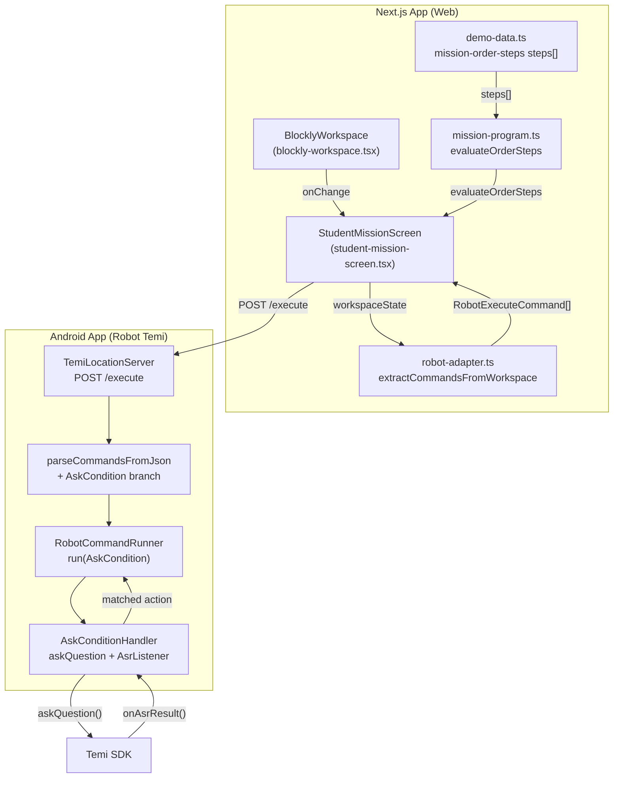
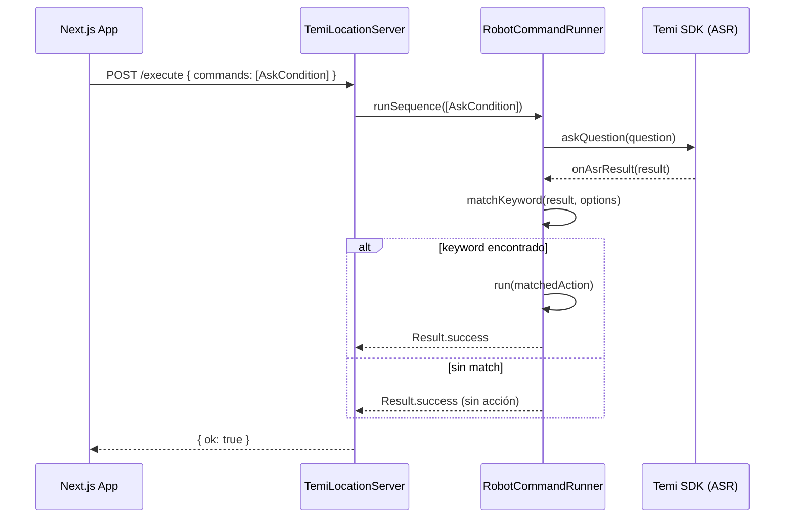
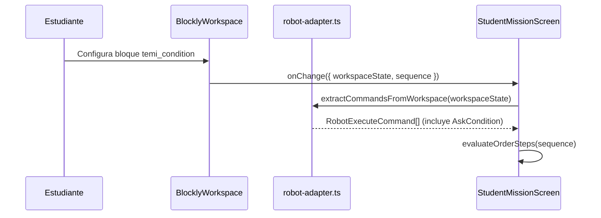

# Design Document: condition-blocks

## Overview

Agrega un nuevo bloque Blockly `temi_condition` a la misión "Taller Guía mi salón" (`mission-order-steps`) que permite al robot Temi hacer una pregunta en voz alta, escuchar la respuesta del usuario mediante ASR y ejecutar una acción diferente según la opción reconocida. El bloque se serializa como un nuevo comando `AskCondition` que el endpoint `/execute` de la app Android procesa usando `askQuestion` del SDK de Temi y `AsrListener.onAsrResult`.

---

## Arquitectura



---

## Diagramas de secuencia

### Flujo de ejecución del bloque de condición



### Flujo de serialización Blockly → comando



---

## Componentes e interfaces

### 1. Bloque Blockly `temi_condition` (blockly-workspace.tsx)

**Propósito**: Bloque visual que el estudiante arrastra al workspace para definir una pregunta y sus ramas de respuesta.

**Estructura del bloque**:
- Campo `QUESTION` (field_input): texto de la pregunta
- Campo `OPTION_COUNT` (field_number, min 2, max 5): número de opciones
- Por cada opción `i` (1..N):
  - Campo `KEYWORD_i` (field_input): palabra clave que el ASR debe reconocer
  - Campo `ACTION_TYPE_i` (field_dropdown): tipo de acción (`Navigate` | `Say` | `ShowImage`)
  - Campo `ACTION_VALUE_i` (field_input): valor de la acción (ubicación, texto, o base64)

**Categoría en toolbox**: `"Condición"` — color `#c84b1f`

**Responsabilidades**:
- Renderizar campos dinámicos según `OPTION_COUNT`
- Serializar todos los campos en el workspace state de Blockly
- Conectarse en la cadena de bloques (`previousStatement`, `nextStatement`)

**Interfaz**:
```typescript
interface ConditionBlockFields {
  QUESTION: string
  OPTION_COUNT: number          // 2..5
  KEYWORD_1: string
  ACTION_TYPE_1: "Navigate" | "Say" | "ShowImage"
  ACTION_VALUE_1: string
  KEYWORD_2: string
  ACTION_TYPE_2: "Navigate" | "Say" | "ShowImage"
  ACTION_VALUE_2: string
  // ... hasta KEYWORD_N / ACTION_TYPE_N / ACTION_VALUE_N
}
```

---

### 2. Tipos de comando (robot-adapter.ts)

**Nuevos tipos a agregar**:

```typescript
export type ConditionAction =
  | { type: "Navigate"; location: string }
  | { type: "Say"; text: string }
  | { type: "ShowImage"; imageBase64: string }

export type ConditionOption = {
  keyword: string
  action: ConditionAction
}

export type AskConditionCommand = {
  type: "AskCondition"
  question: string
  options: ConditionOption[]
}

// Extender la unión existente:
export type RobotExecuteCommand =
  | NavigateCommand
  | SayCommand
  | ShowImageCommand
  | ShowVideoCommand
  | AskConditionCommand   // ← nuevo
```

---

### 3. Extracción de comandos (robot-adapter.ts)

**Función a modificar**: `extractCommandsFromWorkspace`

**Nueva rama en `walk()`**:

```typescript
} else if (b["type"] === "temi_condition") {
  const question = fields?.["QUESTION"]
  const optionCount = parseInt(fields?.["OPTION_COUNT"] ?? "2", 10)
  if (question && optionCount >= 2) {
    const options: ConditionOption[] = []
    for (let i = 1; i <= optionCount; i++) {
      const keyword = fields?.[`KEYWORD_${i}`]
      const actionType = fields?.[`ACTION_TYPE_${i}`] as ConditionAction["type"]
      const actionValue = fields?.[`ACTION_VALUE_${i}`]
      if (keyword && actionType && actionValue) {
        const action = buildConditionAction(actionType, actionValue)
        if (action) options.push({ keyword, action })
      }
    }
    if (options.length >= 2) {
      commands.push({ type: "AskCondition", question, options })
    }
  }
}
```

**Nueva función auxiliar**:

```typescript
function buildConditionAction(
  type: ConditionAction["type"],
  value: string
): ConditionAction | null {
  switch (type) {
    case "Navigate":  return { type: "Navigate", location: value }
    case "Say":       return { type: "Say", text: value }
    case "ShowImage": return { type: "ShowImage", imageBase64: value }
    default:          return null
  }
}
```

---

### 4. Tipos de misión (mission-program.ts)

**Extensión de `ProgramBlockType`**:

```typescript
export type ProgramBlockType =
  | "temi_start" | "temi_move" | "temi_say"
  | "temi_show" | "temi_audio" | "temi_show_image"
  | "temi_show_video"
  | "temi_condition"   // ← nuevo
```

**Nuevo paso en `orderStepsProgram`** (o en `mission-order-steps.steps[]` en `demo-data.ts`):

```typescript
{
  type: "temi_condition",
  label: "¡Pregunta al visitante!",
  helper: "Haz que Temi pregunte y reaccione según la respuesta."
}
```

---

### 5. Android — nuevo comando `AskCondition` (RobotCommandRunner.kt)

**Extensión del sealed class**:

```kotlin
sealed class RobotCommand {
    data class Navigate(val location: String) : RobotCommand()
    data class Say(val text: String) : RobotCommand()
    data class ShowImage(val imageBase64: String, val durationMs: Long = 7000L) : RobotCommand()
    data class ShowVideo(val videoUrl: String) : RobotCommand()
    data class AskCondition(          // ← nuevo
        val question: String,
        val options: List<ConditionOption>
    ) : RobotCommand()
}

data class ConditionOption(
    val keyword: String,
    val action: RobotCommand         // Navigate | Say | ShowImage
)
```

---

### 6. Android — ejecución ASR (RobotReflectionRunner.kt)

**Nueva función `askConditionAndWait`**:

```kotlin
private fun askConditionAndWait(
    question: String,
    options: List<ConditionOption>
): Result<Unit> {
    // 1. Hablar la pregunta
    val speakResult = speakAndWait(question)
    if (speakResult.isFailure) return speakResult

    // 2. Registrar AsrListener y esperar resultado
    val latch = CountDownLatch(1)
    var matchedAction: RobotCommand? = null

    val asrListenerClass = Class.forName("com.robotemi.sdk.listeners.AsrListener")
    val listener = Proxy.newProxyInstance(
        asrListenerClass.classLoader,
        arrayOf(asrListenerClass)
    ) { proxy, method, args ->
        if (method.name == "onAsrResult") {
            val asrText = args?.getOrNull(0)?.toString()?.lowercase() ?: ""
            matchedAction = options.firstOrNull { opt ->
                asrText.contains(opt.keyword.lowercase())
            }?.action
            latch.countDown()
        }
        null
    }

    // 3. Activar ASR
    val rClass = Class.forName("com.robotemi.sdk.Robot")
    val robot = rClass.getMethod("getInstance").invoke(null)
    rClass.getMethod("addAsrListener", asrListenerClass).invoke(robot, listener)
    rClass.getMethod("startDefaultNlu").invoke(robot)   // activa escucha

    // 4. Esperar respuesta (timeout 15s)
    val heard = latch.await(15L, TimeUnit.SECONDS)
    rClass.getMethod("removeAsrListener", asrListenerClass).invoke(robot, listener)

    // 5. Ejecutar acción si hubo match
    if (heard && matchedAction != null) {
        return run(matchedAction!!)
    }
    return Result.success(Unit)   // sin match → continuar secuencia
}
```

**Extensión de `run()`**:

```kotlin
override fun run(command: RobotCommand): Result<Unit> = when (command) {
    is RobotCommand.Navigate     -> navigateAndWait(command.location)
    is RobotCommand.Say          -> speakAndWait(command.text)
    is RobotCommand.ShowImage    -> showImageAndWait(command.imageBase64, command.durationMs)
    is RobotCommand.ShowVideo    -> showVideoAndWait(command.videoUrl)
    is RobotCommand.AskCondition -> askConditionAndWait(command.question, command.options)
}
```

---

### 7. Android — parser JSON (TemiLocationServer.kt)

**Nueva rama en `parseCommandsFromJson`**:

```kotlin
"AskCondition" -> {
    val questionMatch = Regex(""""question"\s*:\s*"([^"]+)"""").find(context)
    val question = questionMatch?.groupValues?.getOrNull(1)
    if (!question.isNullOrEmpty()) {
        val options = parseConditionOptions(context)
        if (options.size >= 2) {
            commands.add(RobotCommand.AskCondition(question, options))
        }
    }
}
```

**Nueva función `parseConditionOptions`**:

```kotlin
private fun parseConditionOptions(context: String): List<ConditionOption> {
    val options = mutableListOf<ConditionOption>()
    val keywordRegex = Regex(""""keyword"\s*:\s*"([^"]+)"""")
    val typeRegex    = Regex(""""type"\s*:\s*"([^"]+)"""")
    val locationRx   = Regex(""""location"\s*:\s*"([^"]+)"""")
    val textRx       = Regex(""""text"\s*:\s*"([^"]+)"""")
    val base64Rx     = Regex(""""imageBase64"\s*:\s*"([A-Za-z0-9+/=\r\n]+)"""")

    // Encontrar cada objeto de opción dentro del array "options"
    val optionsArrayMatch = Regex(""""options"\s*:\s*\[(.+?)\]""", RegexOption.DOT_MATCHES_ALL)
        .find(context) ?: return options
    val arrayContent = optionsArrayMatch.groupValues[1]

    // Iterar por cada keyword encontrado
    var searchPos = 0
    while (searchPos < arrayContent.length) {
        val kwMatch = keywordRegex.find(arrayContent, searchPos) ?: break
        val keyword = kwMatch.groupValues[1]
        val nextKw  = keywordRegex.find(arrayContent, kwMatch.range.last + 1)
        val optCtx  = arrayContent.substring(kwMatch.range.first, nextKw?.range?.first ?: arrayContent.length)

        val actionType = typeRegex.find(optCtx)?.groupValues?.getOrNull(1)
        val action: RobotCommand? = when (actionType) {
            "Navigate"  -> locationRx.find(optCtx)?.groupValues?.getOrNull(1)
                               ?.let { RobotCommand.Navigate(it) }
            "Say"       -> textRx.find(optCtx)?.groupValues?.getOrNull(1)
                               ?.let { RobotCommand.Say(it) }
            "ShowImage" -> base64Rx.find(optCtx)?.groupValues?.getOrNull(1)
                               ?.replace("\r","")?.replace("\n","")
                               ?.let { RobotCommand.ShowImage(it) }
            else        -> null
        }
        if (action != null) options.add(ConditionOption(keyword, action))
        searchPos = kwMatch.range.last + 1
    }
    return options
}
```

---

## Modelos de datos

### JSON enviado al robot

```json
{
  "commands": [
    {
      "type": "AskCondition",
      "question": "¿A dónde quieres ir, a la biblioteca o al laboratorio?",
      "options": [
        {
          "keyword": "biblioteca",
          "action": { "type": "Navigate", "location": "Biblioteca" }
        },
        {
          "keyword": "laboratorio",
          "action": { "type": "Navigate", "location": "Laboratorio" }
        }
      ]
    }
  ]
}
```

### Workspace state de Blockly (fragmento)

```json
{
  "type": "temi_condition",
  "id": "abc123",
  "fields": {
    "QUESTION": "¿A dónde quieres ir?",
    "OPTION_COUNT": "2",
    "KEYWORD_1": "biblioteca",
    "ACTION_TYPE_1": "Navigate",
    "ACTION_VALUE_1": "Biblioteca",
    "KEYWORD_2": "laboratorio",
    "ACTION_TYPE_2": "Navigate",
    "ACTION_VALUE_2": "Laboratorio"
  }
}
```

### Reglas de validación

| Campo | Regla |
|---|---|
| `QUESTION` | No vacío, máx. 200 caracteres |
| `OPTION_COUNT` | Entero entre 2 y 5 |
| `KEYWORD_i` | No vacío, sin espacios recomendado |
| `ACTION_TYPE_i` | Uno de: `Navigate`, `Say`, `ShowImage` |
| `ACTION_VALUE_i` | No vacío; si `Navigate`, debe ser ubicación válida del mapa |

---

## Pseudocódigo — algoritmos clave

### Algoritmo: extractConditionCommand

```pascal
ALGORITHM extractConditionCommand(block)
INPUT: block — nodo del workspace serializado de Blockly
OUTPUT: AskConditionCommand | null

BEGIN
  fields ← block.fields
  question ← fields["QUESTION"]
  optionCount ← parseInt(fields["OPTION_COUNT"])

  IF question IS EMPTY OR optionCount < 2 THEN
    RETURN null
  END IF

  options ← []

  FOR i FROM 1 TO optionCount DO
    keyword    ← fields["KEYWORD_" + i]
    actionType ← fields["ACTION_TYPE_" + i]
    actionValue ← fields["ACTION_VALUE_" + i]

    IF keyword IS EMPTY OR actionType IS EMPTY OR actionValue IS EMPTY THEN
      CONTINUE
    END IF

    action ← buildConditionAction(actionType, actionValue)

    IF action IS NOT NULL THEN
      options.push({ keyword, action })
    END IF
  END FOR

  IF options.length < 2 THEN
    RETURN null
  END IF

  RETURN { type: "AskCondition", question, options }
END
```

**Precondiciones:**
- `block.type === "temi_condition"`
- `block.fields` es un objeto no nulo

**Postcondiciones:**
- Retorna `AskConditionCommand` válido si hay ≥2 opciones completas
- Retorna `null` si la pregunta está vacía o hay menos de 2 opciones válidas
- No muta el bloque de entrada

**Invariante de bucle:**
- `options` contiene solo opciones con keyword, actionType y actionValue no vacíos

---

### Algoritmo: askConditionAndWait (Android)

```pascal
ALGORITHM askConditionAndWait(question, options)
INPUT: question — String, options — List<ConditionOption>
OUTPUT: Result<Unit>

BEGIN
  // Paso 1: Hablar la pregunta
  speakResult ← speakAndWait(question)
  IF speakResult IS FAILURE THEN
    RETURN speakResult
  END IF

  // Paso 2: Registrar listener ASR
  latch ← CountDownLatch(1)
  matchedAction ← null

  listener ← AsrListener {
    onAsrResult(asrText):
      normalized ← asrText.lowercase()
      FOR EACH option IN options DO
        IF normalized CONTAINS option.keyword.lowercase() THEN
          matchedAction ← option.action
          BREAK
        END IF
      END FOR
      latch.countDown()
  }

  robot.addAsrListener(listener)
  robot.startDefaultNlu()

  // Paso 3: Esperar respuesta (timeout 15s)
  heard ← latch.await(15, SECONDS)
  robot.removeAsrListener(listener)

  // Paso 4: Ejecutar acción si hubo match
  IF heard AND matchedAction IS NOT NULL THEN
    RETURN run(matchedAction)
  END IF

  RETURN Result.success(Unit)
END
```

**Precondiciones:**
- `question` no es vacío
- `options` tiene al menos 2 elementos
- El SDK de Temi está disponible (`Robot.getInstance() != null`)

**Postcondiciones:**
- Si el ASR reconoce un keyword → ejecuta la acción correspondiente y retorna su resultado
- Si no hay match o timeout → retorna `Result.success(Unit)` (la secuencia continúa)
- El listener ASR siempre se remueve al finalizar (incluso en timeout)

**Invariante de bucle (matching):**
- Se evalúan las opciones en orden; se usa la primera coincidencia encontrada

---

### Algoritmo: matchKeyword

```pascal
ALGORITHM matchKeyword(asrText, options)
INPUT: asrText — String (resultado del ASR), options — List<ConditionOption>
OUTPUT: ConditionOption | null

BEGIN
  normalized ← asrText.trim().lowercase()

  FOR EACH option IN options DO
    IF normalized CONTAINS option.keyword.trim().lowercase() THEN
      RETURN option
    END IF
  END FOR

  RETURN null
END
```

**Precondiciones:**
- `asrText` puede ser vacío (retorna null)
- `options` es una lista no nula (puede estar vacía)

**Postcondiciones:**
- Retorna la primera opción cuyo keyword está contenido en el texto ASR (case-insensitive)
- Retorna null si ningún keyword coincide
- No muta los parámetros de entrada

---

## Manejo de errores

### Escenario 1: Sin match ASR (timeout o no reconocido)

**Condición**: El ASR no devuelve resultado en 15 segundos, o el texto no contiene ningún keyword.
**Respuesta**: El robot no ejecuta ninguna acción de las ramas.
**Recuperación**: La secuencia de comandos continúa con el siguiente bloque. `Result.success(Unit)` se retorna para no interrumpir la ejecución.

### Escenario 2: Bloque incompleto (menos de 2 opciones válidas)

**Condición**: El estudiante no completó todos los campos del bloque.
**Respuesta**: `extractConditionCommand` retorna `null`; el bloque se omite en la lista de comandos.
**Recuperación**: `evaluateOrderSteps` no contará el bloque como completado, mostrando feedback al estudiante.

### Escenario 3: SDK de Temi no disponible

**Condición**: `Robot.getInstance()` retorna null en el Android.
**Respuesta**: `askConditionAndWait` retorna `Result.failure(IllegalStateException)`.
**Recuperación**: `TemiLocationServer` responde `500` con mensaje de error; la app web muestra el error al docente.

### Escenario 4: Acción de rama falla (ej. Navigate a ubicación inexistente)

**Condición**: La acción ejecutada tras el match falla (timeout de navegación, etc.).
**Respuesta**: `run(matchedAction)` retorna `Result.failure`.
**Recuperación**: `runSequence` interrumpe la ejecución y retorna el error al servidor HTTP.

---

## Estrategia de testing

### Unit testing

- `extractCommandsFromWorkspace` con workspace que contiene `temi_condition` → verifica que genera `AskConditionCommand` correcto
- `extractCommandsFromWorkspace` con campos incompletos → verifica que omite el bloque
- `buildConditionAction` con cada tipo de acción → verifica tipos correctos
- `matchKeyword` con texto que contiene keyword → retorna opción correcta
- `matchKeyword` con texto sin match → retorna null
- `matchKeyword` case-insensitive → "Biblioteca" coincide con "biblioteca"

### Property-based testing

**Librería**: fast-check (TypeScript)

**Propiedad 1 — Consistencia de extracción**:
Para cualquier workspace con N opciones válidas (N ≥ 2), `extractCommandsFromWorkspace` siempre produce exactamente un `AskConditionCommand` con N opciones.

**Propiedad 2 — Matching case-insensitive**:
Para cualquier keyword `k` y texto ASR `t` donde `t.toLowerCase().includes(k.toLowerCase())`, `matchKeyword` siempre retorna la opción correspondiente.

**Propiedad 3 — Sin match para texto vacío**:
Para cualquier lista de opciones, `matchKeyword("", options)` siempre retorna null.

### Integration testing

- Enviar JSON `AskCondition` al endpoint `/execute` del Android → verificar que el robot habla la pregunta
- Simular `onAsrResult` con keyword conocido → verificar que ejecuta la acción correcta
- Simular timeout ASR → verificar que la secuencia continúa sin error

---

## Consideraciones de rendimiento

- El timeout de ASR (15s) es fijo y no bloquea el hilo principal del servidor HTTP (se ejecuta en un thread separado por `handleClient`).
- El matching de keywords es O(N×M) donde N = número de opciones (máx. 5) y M = longitud del texto ASR — despreciable.
- El bloque `temi_condition` no almacena imágenes en base64 directamente en los campos del bloque (excepto si `ACTION_TYPE_i = ShowImage`); en ese caso aplican las mismas consideraciones de tamaño que `temi_show_image`.

---

## Consideraciones de seguridad

- Los keywords son texto libre definido por el estudiante; no se ejecutan como código.
- El JSON del comando `AskCondition` se parsea con regex (igual que los comandos existentes), sin deserialización dinámica de clases.
- Las acciones anidadas (`ConditionAction`) solo pueden ser `Navigate`, `Say` o `ShowImage` — no se permite `AskCondition` anidado para evitar recursión infinita.

---

## Dependencias

- **Blockly 12.5.1** — API de definición de bloques (`Blockly.common.defineBlocksWithJsonArray`, `Blockly.Blocks[].init`)
- **Temi SDK** — `Robot.askQuestion()`, `AsrListener.onAsrResult()`, `Robot.startDefaultNlu()`, `Robot.addAsrListener()`, `Robot.removeAsrListener()`
- **fast-check** — property-based testing en TypeScript (ya presente o a agregar como devDependency)
- Sin nuevas dependencias de producción en Next.js ni en Android

---

## Correctness Properties

*Una propiedad es una característica o comportamiento que debe cumplirse en todas las ejecuciones válidas del sistema — esencialmente, una afirmación formal sobre lo que el sistema debe hacer. Las propiedades sirven como puente entre las especificaciones legibles por humanos y las garantías de corrección verificables automáticamente.*

---

### Property 1: Campos dinámicos según OPTION_COUNT

*Para cualquier* valor N en el rango [2, 5], cuando el bloque `temi_condition` tiene `OPTION_COUNT = N`, el workspace serializado SHALL contener exactamente N grupos de campos `KEYWORD_i`, `ACTION_TYPE_i` y `ACTION_VALUE_i` (para i de 1 a N), ni más ni menos.

**Validates: Requirements 1.4, 2.3**

---

### Property 2: Serialización completa del bloque temi_condition

*Para cualquier* configuración válida del bloque `temi_condition` (QUESTION no vacío, OPTION_COUNT en [2,5], todos los campos de opciones completos), el workspace state serializado SHALL contener los campos `QUESTION`, `OPTION_COUNT` (como string numérico parseable), y todos los campos `KEYWORD_i`, `ACTION_TYPE_i`, `ACTION_VALUE_i` correspondientes.

**Validates: Requirements 2.1, 2.2, 2.3**

---

### Property 3: Extracción produce AskConditionCommand válido

*Para cualquier* workspace serializado que contenga un bloque `temi_condition` con `QUESTION` no vacío y al menos 2 opciones completas (keyword, actionType y actionValue no vacíos), `extractCommandsFromWorkspace` SHALL producir exactamente un `AskConditionCommand` cuya pregunta y opciones coincidan con los campos del bloque, en el mismo orden.

**Validates: Requirements 3.1, 3.7**

---

### Property 4: buildConditionAction construye la acción correcta para cada tipo

*Para cualquier* par `(actionType, actionValue)` donde `actionType` es uno de `"Navigate"`, `"Say"` o `"ShowImage"` y `actionValue` es un string no vacío, `buildConditionAction` SHALL retornar una `ConditionAction` del tipo correspondiente con el valor correcto asignado al campo apropiado (`location`, `text` o `imageBase64`).

**Validates: Requirements 3.4, 3.5, 3.6**

---

### Property 5: Round-trip serialización JSON ↔ parsing Android

*Para cualquier* `AskConditionCommand` válido (pregunta no vacía, ≥2 opciones con tipos de acción válidos), serializar el comando a JSON y luego parsearlo con `parseCommandsFromJson` en Android SHALL producir un `RobotCommand.AskCondition` equivalente: misma pregunta, mismo número de opciones, mismos keywords y mismos tipos y valores de acción, en el mismo orden.

**Validates: Requirements 4.1, 4.2, 4.3, 4.4, 4.5, 5.1, 5.3, 5.4, 5.5**

---

### Property 6: Matching case-insensitive por contains

*Para cualquier* string `asrText` y lista de `ConditionOption` donde `asrText.trim().lowercase()` contiene `option.keyword.trim().lowercase()` para al menos una opción, `matchKeyword(asrText, options)` SHALL retornar la primera opción cuyo keyword esté contenido en el texto normalizado, independientemente de la capitalización original de ambos strings.

**Validates: Requirements 7.1, 7.4**

---

### Property 7: Primera coincidencia gana en matching

*Para cualquier* texto ASR y lista de opciones donde múltiples keywords coinciden con el texto, `matchKeyword` SHALL retornar siempre la opción con el índice más bajo (primera en el orden de la lista), garantizando determinismo en la selección.

**Validates: Requirements 7.2**

---

### Property 8: Texto vacío o solo espacios no produce match

*Para cualquier* lista de opciones (incluyendo listas con keywords de un solo carácter), `matchKeyword` con un texto ASR compuesto únicamente de espacios en blanco (incluyendo el string vacío) SHALL retornar null, sin ejecutar ninguna acción.

**Validates: Requirements 7.3**

---

### Property 9: Sin match o timeout → secuencia continúa sin error

*Para cualquier* `AskConditionCommand` y cualquier texto ASR que no contenga ningún keyword de las opciones (o ante un timeout de 15 segundos), `askConditionAndWait` SHALL retornar `Result.success(Unit)`, permitiendo que la secuencia de comandos continúe con el siguiente bloque sin interrupciones.

**Validates: Requirements 6.5**

---

### Property 10: AsrListener siempre se remueve al finalizar

*Para cualquier* ejecución de `askConditionAndWait` — independientemente de si hubo match, no hubo match, se produjo timeout o la acción ejecutada falló — el `AsrListener` registrado SHALL ser removido del SDK de Temi antes de que la función retorne.

**Validates: Requirements 6.6**

---

### Property 11: evaluateOrderSteps cuenta temi_condition como paso válido

*Para cualquier* secuencia de bloques que incluya `temi_condition` en la posición esperada por el programa de la misión, `evaluateOrderSteps` SHALL incrementar `completedSteps` en 1 al procesar ese bloque, de la misma forma que lo hace con cualquier otro tipo de bloque válido.

**Validates: Requirements 8.2, 8.3**
