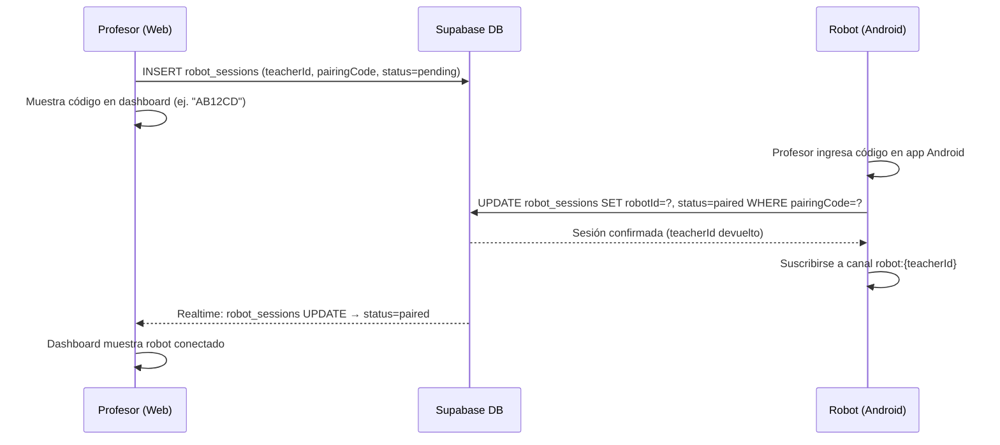
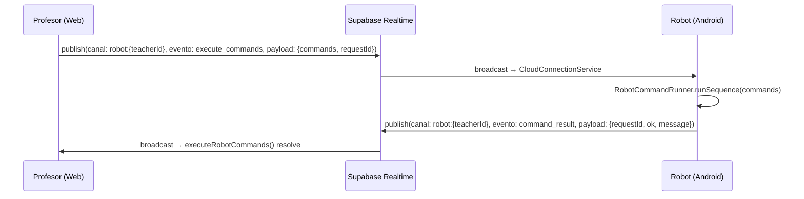

# Design Document: robot-cloud-connection

## Overview

Actualmente la web app se comunica con el robot Temi V3 mediante HTTP directo a una IP local (`http://192.168.10.64:8765`), lo que impide su uso cuando la web está desplegada en internet. Esta funcionalidad reemplaza ese canal por **Supabase Realtime** como relay en la nube, introduciendo un flujo de emparejamiento por código para que cada robot quede vinculado a un profesor específico.

El flujo cambia de `fetch → http://robot-ip/execute` a `publish → Supabase Realtime channel → Android app`, manteniendo la misma interfaz de comandos (`RobotExecuteCommand`) que ya existe en `robot-adapter.ts`. La app Android se suscribe al canal del profesor usando el SDK de Supabase para Kotlin y ejecuta los comandos con el `RobotCommandRunner` existente.

## Architecture

```mermaid
graph TD
    subgraph Web["Web App (Next.js)"]
        DA[robot-adapter.ts<br/>executeRobotCommands]
        PC[PairingCodePanel<br/>Dashboard UI]
        SS[supabase-store.ts<br/>robot_sessions CRUD]
    end

    subgraph Supabase["Supabase (Cloud)"]
        DB[(robot_sessions<br/>table)]
        RT[Realtime Channel<br/>robot:{teacherId}]
    end

    subgraph Android["App Android (Temi V3)"]
        CS[CloudConnectionService<br/>Hilt Singleton]
        CR[RobotCommandRunner<br/>existing]
        HVM[HomeViewModel<br/>existing]
    end

    PC -->|generate pairing code| SS
    SS -->|upsert robot_sessions| DB
    CS -->|register with pairing code| DB
    DB -->|session confirmed| CS
    CS -->|subscribe| RT
    DA -->|publish command payload| RT
    RT -->|broadcast| CS
    CS -->|runSequence| CR
    CR -->|execute on Temi SDK| Android
    CS -->|publish result| RT
    RT -->|result event| DA
    HVM -->|start/stop| CS
```

## Sequence Diagrams

### Flujo de emparejamiento



### Flujo de ejecución de comandos



## Components and Interfaces

### Web: `robot-adapter.ts` — executeRobotCommands (modificado)

**Purpose**: Reemplazar el `fetch` HTTP directo por publicación en Supabase Realtime, manteniendo la misma firma pública.

**Interface** (TypeScript):
```typescript
// Contrato público sin cambios — los llamadores no se modifican
export async function executeRobotCommands(
  commands: RobotExecuteCommand[],
  teacherId: string
): Promise<RobotRunResult>

// Internamente usa:
interface CommandPayload {
  requestId: string        // UUID para correlacionar respuesta
  commands: RobotExecuteCommand[]
  sentAt: string           // ISO timestamp
}

interface ResultPayload {
  requestId: string
  ok: boolean
  message: string
  executedAt: string
}
```

**Responsibilities**:
- Publicar el payload en el canal `robot:{teacherId}` con evento `execute_commands`
- Esperar el evento `command_result` con el mismo `requestId` (timeout 5 min)
- Retornar `RobotRunResult` al llamador

---

### Web: `supabase-store.ts` — robot sessions CRUD (nuevo)

**Purpose**: Operaciones CRUD sobre la tabla `robot_sessions` y generación de códigos de emparejamiento.

**Interface** (TypeScript):
```typescript
export interface RobotSession {
  id: string
  teacherId: string
  robotId: string | null
  pairingCode: string       // 6 chars alfanumérico mayúscula
  status: 'pending' | 'paired' | 'disconnected'
  lastSeenAt: string | null
  createdAt: string
}

export async function createRobotSession(teacherId: string): Promise<RobotSession>
export async function fetchRobotSessionByTeacher(teacherId: string): Promise<RobotSession | null>
export async function deleteRobotSession(sessionId: string): Promise<void>
export function subscribeToRobotSession(
  teacherId: string,
  onUpdate: (session: RobotSession) => void
): RealtimeChannel
```

---

### Web: `PairingCodePanel` (nuevo componente UI)

**Purpose**: Mostrar el código de emparejamiento en el dashboard del profesor y el estado de conexión del robot.

**Interface** (TypeScript/React):
```typescript
interface PairingCodePanelProps {
  teacherId: string
  onRobotConnected?: (robotId: string) => void
}

// Estados internos:
// idle → generating → waiting_robot → paired → error
```

**Responsibilities**:
- Llamar a `createRobotSession` para generar el código
- Suscribirse a cambios en `robot_sessions` vía Realtime
- Mostrar el código de 6 caracteres de forma prominente
- Transicionar a estado "conectado" cuando `status === 'paired'`

---

### Android: `CloudConnectionService` (nuevo)

**Purpose**: Singleton Hilt que gestiona la conexión con Supabase Realtime, el emparejamiento y la recepción de comandos.

**Interface** (Kotlin):
```kotlin
@Singleton
class CloudConnectionService @Inject constructor(
    private val commandRunner: RobotCommandRunner,
    private val supabaseClient: SupabaseClient
) {
    val connectionState: StateFlow<CloudConnectionState>

    suspend fun pair(pairingCode: String): PairingResult
    fun startListening()   // suscribirse al canal del profesor
    fun stopListening()    // cancelar suscripción y limpiar
}

sealed class CloudConnectionState {
    object Idle : CloudConnectionState()
    object Pairing : CloudConnectionState()
    data class Connected(val teacherId: String, val robotId: String) : CloudConnectionState()
    data class Error(val message: String) : CloudConnectionState()
}

sealed class PairingResult {
    data class Success(val teacherId: String) : PairingResult()
    data class Failure(val reason: String) : PairingResult()
}
```

---

### Android: `CloudModule` (nuevo módulo Hilt)

**Purpose**: Proveer `SupabaseClient` como singleton inyectable.

```kotlin
@Module
@InstallIn(SingletonComponent::class)
object CloudModule {
    @Provides
    @Singleton
    fun provideSupabaseClient(): SupabaseClient =
        createSupabaseClient(
            supabaseUrl = BuildConfig.SUPABASE_URL,
            supabaseKey = BuildConfig.SUPABASE_ANON_KEY
        ) {
            install(Realtime)
            install(Postgrest)
        }
}
```

---

### Android: `PairingScreen` (nueva pantalla UI)

**Purpose**: Pantalla en Jetpack Compose donde el profesor ingresa el código de 6 caracteres para emparejar el robot.

```kotlin
@Composable
fun PairingScreen(
    viewModel: PairingViewModel = hiltViewModel(),
    onPaired: () -> Unit
)
```

## Data Models

### Tabla Supabase: `robot_sessions`

```sql
CREATE TABLE robot_sessions (
  id            UUID PRIMARY KEY DEFAULT gen_random_uuid(),
  teacher_id    TEXT NOT NULL,
  robot_id      TEXT,
  pairing_code  CHAR(6) NOT NULL UNIQUE,
  status        TEXT NOT NULL DEFAULT 'pending'
                  CHECK (status IN ('pending', 'paired', 'disconnected')),
  last_seen_at  TIMESTAMPTZ,
  created_at    TIMESTAMPTZ NOT NULL DEFAULT now()
);

-- Un profesor solo puede tener una sesión activa
CREATE UNIQUE INDEX robot_sessions_teacher_active
  ON robot_sessions (teacher_id)
  WHERE status IN ('pending', 'paired');

-- RLS: solo el profesor dueño puede leer/escribir su sesión
ALTER TABLE robot_sessions ENABLE ROW LEVEL SECURITY;
```

### TypeScript: `RobotSession`

```typescript
export interface RobotSession {
  id: string
  teacherId: string
  robotId: string | null
  pairingCode: string
  status: 'pending' | 'paired' | 'disconnected'
  lastSeenAt: string | null
  createdAt: string
}
```

### Kotlin: `RobotSessionRow`

```kotlin
@Serializable
data class RobotSessionRow(
    val id: String,
    @SerialName("teacher_id") val teacherId: String,
    @SerialName("robot_id") val robotId: String?,
    @SerialName("pairing_code") val pairingCode: String,
    val status: String,
    @SerialName("last_seen_at") val lastSeenAt: String?,
    @SerialName("created_at") val createdAt: String
)
```

### Realtime: Payload de comandos

```typescript
// Evento: execute_commands (web → robot)
interface CommandPayload {
  requestId: string          // UUID v4
  commands: RobotExecuteCommand[]
  sentAt: string             // ISO 8601
}

// Evento: command_result (robot → web)
interface ResultPayload {
  requestId: string
  ok: boolean
  message: string
  executedAt: string
}
```

## Key Functions with Formal Specifications

### `executeRobotCommands` (web, modificado)

```typescript
export async function executeRobotCommands(
  commands: RobotExecuteCommand[],
  teacherId: string
): Promise<RobotRunResult>
```

**Preconditions:**
- `commands` es un array no vacío de `RobotExecuteCommand` válidos
- `teacherId` es un string no vacío que identifica a un profesor con sesión `paired`
- El canal Supabase Realtime `robot:{teacherId}` está disponible

**Postconditions:**
- Si el robot responde antes del timeout: retorna `{ ok: true/false, message }` según el resultado
- Si el timeout expira (5 min): retorna `{ ok: false, message: "Tiempo de espera agotado" }`
- Si el canal no está disponible: retorna `{ ok: false, message: "Robot no conectado" }`
- No lanza excepciones — siempre retorna `RobotRunResult`

---

### `CloudConnectionService.pair` (Android)

```kotlin
suspend fun pair(pairingCode: String): PairingResult
```

**Preconditions:**
- `pairingCode` tiene exactamente 6 caracteres alfanuméricos
- Existe una fila en `robot_sessions` con ese `pairingCode` y `status = 'pending'`
- El dispositivo tiene conectividad a internet

**Postconditions:**
- Si exitoso: `robot_sessions` actualizado con `robotId` y `status = 'paired'`; `connectionState` transiciona a `Connected`
- Si el código no existe o ya fue usado: retorna `PairingResult.Failure`
- Si hay error de red: retorna `PairingResult.Failure` con mensaje descriptivo

---

### `CloudConnectionService.startListening` (Android)

```kotlin
fun startListening()
```

**Preconditions:**
- `connectionState` es `Connected` (emparejamiento completado)
- `SupabaseClient` está inicializado

**Postconditions:**
- El servicio está suscrito al canal `robot:{teacherId}` en Supabase Realtime
- Cada evento `execute_commands` recibido dispara `commandRunner.runSequence()`
- El resultado se publica de vuelta en el canal como `command_result`
- Idempotente: llamadas múltiples no crean suscripciones duplicadas

## Algorithmic Pseudocode

### Algoritmo de emparejamiento (Android)

```kotlin
// CloudConnectionService.pair
suspend fun pair(pairingCode: String): PairingResult {
    // 1. Validar formato del código
    if (pairingCode.length != 6) return PairingResult.Failure("Código inválido")

    // 2. Buscar sesión en Supabase
    val session = supabaseClient
        .from("robot_sessions")
        .select { filter { eq("pairing_code", pairingCode); eq("status", "pending") } }
        .decodeSingleOrNull<RobotSessionRow>()
        ?: return PairingResult.Failure("Código no encontrado o ya usado")

    // 3. Registrar robotId y marcar como paired
    val robotId = generateRobotId()  // UUID local persistido en SharedPreferences
    supabaseClient.from("robot_sessions").update({
        set("robot_id", robotId)
        set("status", "paired")
        set("last_seen_at", Clock.System.now().toString())
    }) { filter { eq("id", session.id) } }

    // 4. Persistir teacherId localmente
    prefs.saveTeacherId(session.teacherId)
    _connectionState.value = CloudConnectionState.Connected(session.teacherId, robotId)

    return PairingResult.Success(session.teacherId)
}
```

### Algoritmo de escucha de comandos (Android)

```kotlin
// CloudConnectionService.startListening
fun startListening() {
    val teacherId = (connectionState.value as? Connected)?.teacherId ?: return
    if (activeChannel != null) return  // ya suscrito

    activeChannel = supabaseClient.realtime.channel("robot:$teacherId")

    activeChannel!!.broadcastFlow<CommandPayload>("execute_commands")
        .onEach { payload ->
            // Ejecutar en coroutine para no bloquear el canal
            scope.launch {
                val result = commandRunner.runSequence(payload.commands.toRobotCommands())
                activeChannel!!.broadcast("command_result", ResultPayload(
                    requestId = payload.requestId,
                    ok = result.isSuccess,
                    message = result.exceptionOrNull()?.message ?: "Ejecutado",
                    executedAt = Clock.System.now().toString()
                ))
            }
        }
        .launchIn(scope)

    supabaseClient.realtime.connect()
}
```

### Algoritmo de publicación de comandos (Web)

```typescript
// robot-adapter.ts — executeRobotCommands (nuevo)
export async function executeRobotCommands(
  commands: RobotExecuteCommand[],
  teacherId: string
): Promise<RobotRunResult> {
  const channel = supabase.channel(`robot:${teacherId}`)
  const requestId = crypto.randomUUID()

  return new Promise((resolve) => {
    const timeout = setTimeout(() => {
      channel.unsubscribe()
      resolve({ ok: false, message: "Tiempo de espera agotado" })
    }, 300_000) // 5 min

    // Escuchar resultado antes de publicar (evitar race condition)
    channel.on("broadcast", { event: "command_result" }, ({ payload }) => {
      const result = payload as ResultPayload
      if (result.requestId !== requestId) return
      clearTimeout(timeout)
      channel.unsubscribe()
      resolve({ ok: result.ok, message: result.message })
    })

    channel.subscribe((status) => {
      if (status !== "SUBSCRIBED") return
      void channel.send({
        type: "broadcast",
        event: "execute_commands",
        payload: { requestId, commands, sentAt: new Date().toISOString() }
      })
    })
  })
}
```

## Example Usage

### Web: Ejecutar comandos desde el dashboard

```typescript
// Antes (HTTP directo — solo funciona en red local)
const result = await executeRobotCommands(commands)

// Después (Supabase Realtime — funciona desde internet)
const result = await executeRobotCommands(commands, session.userId)
```

### Web: Generar código de emparejamiento

```typescript
// En el dashboard del profesor
const session = await createRobotSession(teacherId)
console.log(`Código: ${session.pairingCode}`) // "AB12CD"

// Suscribirse a cambios para detectar cuando el robot se conecta
const channel = subscribeToRobotSession(teacherId, (updated) => {
  if (updated.status === 'paired') {
    console.log(`Robot ${updated.robotId} conectado`)
  }
})
```

### Android: Emparejar robot y escuchar comandos

```kotlin
// En PairingViewModel
viewModelScope.launch {
    when (val result = cloudConnectionService.pair(pairingCode)) {
        is PairingResult.Success -> {
            cloudConnectionService.startListening()
            onPaired()
        }
        is PairingResult.Failure -> showError(result.reason)
    }
}
```

### Android: Integración en HomeViewModel

```kotlin
// HomeViewModel — agregar al init {}
init {
    locationServer.start()
    // Reanudar escucha si ya estaba emparejado
    if (cloudConnectionService.connectionState.value is Connected) {
        cloudConnectionService.startListening()
    }
    // ... resto del init existente
}

override fun onCleared() {
    super.onCleared()
    locationServer.stop()
    cloudConnectionService.stopListening()
}
```

## Correctness Properties

- Para todo `teacherId` válido, `executeRobotCommands` siempre retorna un `RobotRunResult` (nunca lanza excepción)
- Para todo código de emparejamiento, solo un robot puede quedar en estado `paired` simultáneamente por profesor (garantizado por el índice único en DB)
- Si `CloudConnectionService.startListening()` se llama múltiples veces, solo existe una suscripción activa al canal
- Todo comando publicado con `requestId` R recibe exactamente una respuesta con ese mismo `requestId`
- Si el robot está ocupado ejecutando una secuencia, los comandos entrantes se encolan (no se descartan ni se ejecutan en paralelo)
- El estado `connectionState` en Android solo transiciona a `Connected` si la actualización en `robot_sessions` fue exitosa

## Error Handling

### Robot no emparejado al intentar ejecutar

**Condition**: `fetchRobotSessionByTeacher` retorna `null` o `status !== 'paired'`
**Response**: `executeRobotCommands` retorna `{ ok: false, message: "Robot no conectado. Empareja el robot desde el dashboard." }`
**Recovery**: El profesor abre el panel de emparejamiento y genera un nuevo código

### Código de emparejamiento expirado o inválido (Android)

**Condition**: No existe fila con ese `pairingCode` y `status = 'pending'`
**Response**: `pair()` retorna `PairingResult.Failure("Código no encontrado o ya usado")`
**Recovery**: El profesor genera un nuevo código desde el dashboard

### Pérdida de conexión Realtime (Android)

**Condition**: El canal Supabase Realtime se desconecta inesperadamente
**Response**: El SDK de Supabase intenta reconexión automática con backoff exponencial
**Recovery**: `CloudConnectionService` escucha el evento de reconexión y re-suscribe al canal; actualiza `last_seen_at` en DB

### Timeout de respuesta del robot (Web)

**Condition**: El robot no responde en 5 minutos
**Response**: `executeRobotCommands` retorna `{ ok: false, message: "Tiempo de espera agotado" }`
**Recovery**: El profesor puede reintentar; la UI muestra el error sin bloquear

### Robot ocupado (ejecución concurrente)

**Condition**: Llega un nuevo `execute_commands` mientras `commandRunner.runSequence()` está en curso
**Response**: Los comandos se encolan en una `Channel<CommandPayload>` de Kotlin con capacidad `UNLIMITED`
**Recovery**: Se procesan en orden FIFO al terminar la ejecución actual

## Testing Strategy

### Unit Testing

- `executeRobotCommands`: mock del canal Supabase, verificar que publica el payload correcto y resuelve con el resultado del robot
- `createRobotSession`: mock de Supabase client, verificar generación de código único de 6 chars
- `CloudConnectionService.pair`: mock de Supabase, verificar transiciones de estado y persistencia local
- `CloudConnectionService.startListening`: verificar idempotencia y que los comandos recibidos se pasan a `commandRunner`

### Property-Based Testing

**Librería**: `fast-check` (web) / `kotest-property` (Android)

- Para cualquier lista de `RobotExecuteCommand[]`, `executeRobotCommands` siempre retorna `RobotRunResult` (nunca lanza)
- Para cualquier string de 6 chars alfanuméricos, `pair()` retorna `Success` o `Failure` (nunca lanza)
- El código de emparejamiento generado siempre tiene exactamente 6 caracteres alfanuméricos en mayúscula

### Integration Testing

- Flujo completo de emparejamiento: web genera código → Android lo usa → DB actualizada → web recibe notificación Realtime
- Flujo de ejecución end-to-end: web publica comando → Android ejecuta → web recibe resultado

## Performance Considerations

- Los canales Realtime de Supabase tienen latencia típica de 50-200ms, aceptable para comandos de robot educativo
- El payload de `ShowImage` puede ser grande (base64). Se recomienda mantener el límite actual de la app y considerar subir la imagen a Supabase Storage y pasar solo la URL en el comando
- `last_seen_at` se actualiza en cada comando recibido para monitoreo de conectividad, sin impacto significativo en rendimiento

## Security Considerations

- **RLS en `robot_sessions`**: cada profesor solo puede leer y modificar su propia sesión
- **Códigos de emparejamiento**: 6 chars alfanuméricos = ~2.2 mil millones de combinaciones; expiración recomendada de 10 minutos para sesiones `pending`
- **Canal Realtime**: el canal `robot:{teacherId}` debe validarse con RLS de Supabase Realtime para que solo el profesor dueño pueda publicar en él
- **`SUPABASE_ANON_KEY` en Android**: usar `BuildConfig` con variables de entorno en CI, nunca hardcodeado en el código fuente

## Dependencies

### Web
- `@supabase/supabase-js` ^2.103.0 — ya instalado, incluye Realtime

### Android (nuevas dependencias en `build.gradle.kts`)
```kotlin
// Supabase Kotlin SDK
implementation("io.github.jan-tennert.supabase:realtime-kt:3.0.0")
implementation("io.github.jan-tennert.supabase:postgrest-kt:3.0.0")
implementation("io.github.jan-tennert.supabase:gotrue-kt:3.0.0")
// Ktor engine para Supabase SDK
implementation("io.ktor:ktor-client-okhttp:2.3.12")
// Kotlinx serialization (probablemente ya presente)
implementation("org.jetbrains.kotlinx:kotlinx-serialization-json:1.7.1")
```

### Supabase (infraestructura)
- Nueva tabla `robot_sessions` con RLS habilitado
- Realtime habilitado para la tabla `robot_sessions` (INSERT, UPDATE)
- Canal Broadcast `robot:{teacherId}` — no requiere configuración adicional en Supabase
