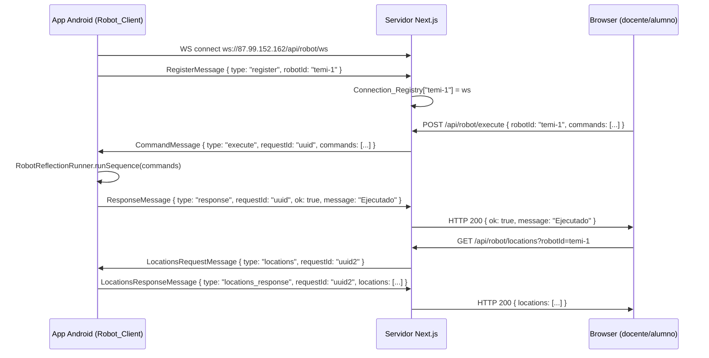

# Design Document: robot-server-proxy

## Overview

La arquitectura actual conecta el browser directamente al robot Temi en `http://IP_ROBOT:8765`. Esto falla en producción porque el servidor (`87.99.152.162`) y el robot están en redes distintas (red del colegio), y el robot no es accesible desde internet.

Esta feature reemplaza esa arquitectura por una de **conexión inversa WebSocket**: el robot inicia una conexión WebSocket saliente al servidor, se registra con un `robotId`, y el servidor mantiene un mapa de conexiones activas. El browser envía comandos al servidor vía HTTP REST, y el servidor los reenvía al robot por el WebSocket ya establecido.

### Beneficios clave

- El robot no necesita ser accesible desde internet (solo necesita salida HTTP/WS)
- Soporta múltiples robots de distintos colegios simultáneamente
- El docente configura un `robotId` legible en lugar de una IP

---

## Architecture



### Componentes principales

1. **`server.ts`** — Servidor Node.js custom que arranca Next.js y adjunta el WebSocket server al mismo puerto
2. **`src/lib/ws-registry.ts`** — Connection_Registry: `Map<string, WebSocket>` compartido en memoria del proceso
3. **`src/app/api/robot/ws/route.ts`** — Manejador WebSocket (lógica de registro y dispatch de mensajes)
4. **`src/app/api/robot/execute/route.ts`** — `POST /api/robot/execute`
5. **`src/app/api/robot/locations/route.ts`** — `GET /api/robot/locations`
6. **`src/app/api/robot/status/route.ts`** — `GET /api/robot/status`
7. **`src/lib/robot-adapter.ts`** — Actualizado para usar `robotId` en lugar de IP
8. **`RobotWebSocketClient.kt`** — Nuevo módulo Android con OkHttp WebSocket

---

## Components and Interfaces

### Server-side: `server.ts`

Next.js no soporta WebSocket en API routes estándar. La solución es un servidor Node.js custom que:
1. Crea un servidor HTTP con `http.createServer()`
2. Pasa el handler de Next.js al servidor HTTP
3. Adjunta un `WebSocketServer` de la librería `ws` al mismo servidor HTTP
4. Intercepta el upgrade de `/api/robot/ws` para manejarlo con el WS server

```typescript
// server.ts (raíz del proyecto)
import { createServer } from "http";
import { parse } from "url";
import next from "next";
import { WebSocketServer } from "ws";
import { handleWsConnection } from "./src/lib/ws-handler";

const app = next({ dev: process.env.NODE_ENV !== "production" });
const handle = app.getRequestHandler();

app.prepare().then(() => {
  const server = createServer((req, res) => {
    const parsedUrl = parse(req.url!, true);
    handle(req, res, parsedUrl);
  });

  const wss = new WebSocketServer({ noServer: true });
  wss.on("connection", handleWsConnection);

  server.on("upgrade", (req, socket, head) => {
    const { pathname } = parse(req.url!);
    if (pathname === "/api/robot/ws") {
      wss.handleUpgrade(req, socket, head, (ws) => {
        wss.emit("connection", ws, req);
      });
    } else {
      socket.destroy();
    }
  });

  const port = parseInt(process.env.PORT ?? "3000", 10);
  server.listen(port, "0.0.0.0", () => {
    console.log(`> Ready on http://0.0.0.0:${port}`);
  });
});
```

El `package.json` se actualiza para usar `ts-node server.ts` en producción:

```json
{
  "scripts": {
    "start": "ts-node --esm server.ts"
  }
}
```

### Server-side: `src/lib/ws-registry.ts`

```typescript
import type { WebSocket } from "ws";

// Singleton en memoria del proceso Node.js
export const connectionRegistry = new Map<string, WebSocket>();

// Map de Promises pendientes: requestId → { resolve, reject }
export const pendingRequests = new Map<string, {
  resolve: (msg: ResponseMessage | LocationsResponseMessage) => void;
  reject: (err: Error) => void;
}>();
```

### Server-side: `src/lib/ws-handler.ts`

Maneja el ciclo de vida de cada conexión WebSocket entrante:

- Al recibir `RegisterMessage`: almacena en `connectionRegistry`, cierra la conexión anterior si existe
- Al recibir `ResponseMessage` o `LocationsResponseMessage`: resuelve la Promise pendiente por `requestId`
- Al cerrar: elimina del `connectionRegistry`
- Si `robotId` vacío: cierra con código 4001

### Server-side: API Routes

**`POST /api/robot/execute`**
```typescript
// Body: { robotId: string, commands: RobotExecuteCommand[] }
// 1. Validar body
// 2. Buscar ws = connectionRegistry.get(robotId)
// 3. Si no existe: 404 { ok: false, message: "Robot no conectado" }
// 4. Generar requestId = crypto.randomUUID()
// 5. Crear Promise y almacenar en pendingRequests
// 6. Enviar CommandMessage por ws
// 7. Await Promise con timeout 300s
// 8. Si timeout: 504 { ok: false, message: "Robot no disponible o tiempo de espera agotado" }
// 9. Si respuesta: 200 { ok, message }
```

**`GET /api/robot/locations`**
```typescript
// Query: ?robotId=string
// 1. Validar robotId
// 2. Buscar ws = connectionRegistry.get(robotId)
// 3. Si no existe: 200 { locations: ["Sala Principal"] }
// 4. Generar requestId, crear Promise
// 5. Enviar LocationsRequestMessage
// 6. Await Promise con timeout 5s
// 7. Si timeout o lista vacía: 200 { locations: ["Sala Principal"] }
// 8. Si respuesta: 200 { locations }
```

**`GET /api/robot/status`**
```typescript
// Query: ?robotId=string
// 1. Validar robotId
// 2. Return 200 { connected: connectionRegistry.has(robotId) }
```

### Client-side: `src/lib/robot-adapter.ts` (actualizado)

Cambios respecto a la versión actual:

- Eliminar `getRobotApiUrl()` y `ROBOT_API_URL`
- Añadir `getRobotId(): string` — lee `esbot.robotId.v1` de localStorage, fallback `"temi-1"`
- Añadir `setRobotId(id: string): void` — persiste en localStorage
- `executeRobotCommands(commands)` → `POST /api/robot/execute { robotId, commands }`
- `fetchRobotLocations()` → `GET /api/robot/locations?robotId={id}`

### Android: `RobotWebSocketClient.kt`

Nuevo módulo en `apps/App_Edulab/app/src/main/java/com/esbot/edulab/core/robot/`:

```kotlin
@Singleton
class RobotWebSocketClient @Inject constructor(
    private val commandRunner: RobotCommandRunner
) {
    private val client = OkHttpClient.Builder()
        .pingInterval(30, TimeUnit.SECONDS)
        .build()

    private var webSocket: WebSocket? = null
    private val robotId: String by lazy { resolveRobotId() }

    @Volatile private var executing = false

    fun start() { connect() }
    fun stop() { webSocket?.close(1000, "App stopped") }

    private fun connect() { /* OkHttp WebSocket connect */ }
    private fun resolveRobotId(): String { /* reflection → Build.SERIAL */ }
    private fun handleMessage(text: String) { /* parse and dispatch */ }
    private fun scheduleReconnect() { /* Handler.postDelayed 5s */ }
}
```

**Flujo de mensajes en Android:**

1. `onOpen` → enviar `RegisterMessage { type: "register", robotId }`
2. `onMessage` → parsear JSON:
   - Si `type == "execute"` → ejecutar con `RobotReflectionRunner.runSequence()`, responder con `ResponseMessage`
   - Si `type == "locations"` → obtener ubicaciones via reflection, responder con `LocationsResponseMessage`
3. `onClosed` / `onFailure` → `scheduleReconnect()` (5s delay)

**Resolución del `robotId`:**
```kotlin
private fun resolveRobotId(): String {
    return try {
        val rClass = Class.forName("com.robotemi.sdk.Robot")
        val robot = rClass.getMethod("getInstance").invoke(null)
        val serial = rClass.getMethod("getSerialNumber").invoke(robot) as? String
        if (!serial.isNullOrBlank()) serial else Build.SERIAL
    } catch (e: Exception) {
        Build.SERIAL.takeIf { it.isNotBlank() } ?: "temi-1"
    }
}
```

### Android: Integración en `HomeViewModel`

`RobotWebSocketClient` reemplaza a `TemiLocationServer` como el punto de entrada de comandos remotos. El `HomeViewModel` inicia el cliente WebSocket en lugar del servidor HTTP local.

---

## Data Models

### Protocolo de mensajes JSON (compartido servidor ↔ robot)

```typescript
// Enviado por el robot al conectarse
type RegisterMessage = {
  type: "register";
  robotId: string;
};

// Enviado por el servidor al robot para ejecutar comandos
type CommandMessage = {
  type: "execute";
  requestId: string;
  commands: RobotExecuteCommand[];
};

// Enviado por el robot al servidor como respuesta a CommandMessage
type ResponseMessage = {
  type: "response";
  requestId: string;
  ok: boolean;
  message: string;
};

// Enviado por el servidor al robot para solicitar ubicaciones
type LocationsRequestMessage = {
  type: "locations";
  requestId: string;
};

// Enviado por el robot al servidor con la lista de ubicaciones
type LocationsResponseMessage = {
  type: "locations_response";
  requestId: string;
  locations: string[];
};
```

### Connection_Registry

```typescript
// En memoria del proceso Node.js — no persiste entre reinicios
const connectionRegistry: Map<string, WebSocket> = new Map();

// Invariante: cada entrada tiene exactamente una conexión WebSocket activa
// Invariante: al cerrar una conexión, su entrada se elimina del mapa
```

### localStorage (browser)

```
clave: "esbot.robotId.v1"
valor: string (e.g., "temi-1", "colegio-san-jose-1")
```

---

## Correctness Properties

*A property is a characteristic or behavior that should hold true across all valid executions of a system — essentially, a formal statement about what the system should do. Properties serve as the bridge between human-readable specifications and machine-verifiable correctness guarantees.*

### Property 1: RegisterMessage contiene el robotId correcto

*For any* `robotId` string configurado en el Robot_Client, cuando se establece una conexión WebSocket, el primer mensaje enviado al servidor debe ser un `RegisterMessage` válido cuyo campo `robotId` sea igual al valor configurado.

**Validates: Requirements 1.2**

---

### Property 2: El registro almacena correctamente el robotId

*For any* `robotId` string válido (no vacío), después de que el servidor recibe un `RegisterMessage` con ese `robotId`, el `Connection_Registry` debe contener una entrada para ese `robotId`.

**Validates: Requirements 2.2**

---

### Property 3: El reregistro reemplaza la conexión anterior

*For any* `robotId`, si se registran dos conexiones WebSocket distintas con el mismo `robotId`, el `Connection_Registry` debe contener únicamente la segunda conexión, y la primera debe haber sido cerrada.

**Validates: Requirements 2.3**

---

### Property 4: El cierre de conexión limpia el registro

*For any* `robotId` registrado, cuando la conexión WebSocket se cierra, el `Connection_Registry` no debe contener ninguna entrada para ese `robotId`.

**Validates: Requirements 2.4**

---

### Property 5: El registro soporta múltiples robots simultáneos

*For any* conjunto de `robotId` distintos, todos pueden estar registrados simultáneamente en el `Connection_Registry` y cada uno es recuperable de forma independiente.

**Validates: Requirements 2.5**

---

### Property 6: Correlación de requestId en execute

*For any* payload de comandos enviado a `POST /api/robot/execute`, el `CommandMessage` enviado al robot debe contener un `requestId` único, y la respuesta HTTP al browser debe corresponder al `ResponseMessage` que contiene ese mismo `requestId`.

**Validates: Requirements 3.2, 3.3**

---

### Property 7: Correlación de requestId en locations

*For any* petición a `GET /api/robot/locations`, el `LocationsRequestMessage` enviado al robot debe contener un `requestId` único, y la respuesta HTTP debe corresponder al `LocationsResponseMessage` con ese mismo `requestId`.

**Validates: Requirements 4.2, 4.3**

---

### Property 8: El estado de conexión refleja el registro

*For any* `robotId`, la respuesta de `GET /api/robot/status?robotId={id}` debe retornar `{ connected: true }` si y solo si ese `robotId` tiene una entrada activa en el `Connection_Registry`.

**Validates: Requirements 7.4**

---

### Property 9: Robot_Adapter usa el robotId del localStorage

*For any* `robotId` almacenado en `localStorage` bajo la clave `esbot.robotId.v1`, las funciones `executeRobotCommands` y `fetchRobotLocations` deben usar ese `robotId` en sus respectivas peticiones HTTP.

**Validates: Requirements 6.1, 6.2, 6.3, 6.4**

---

### Property 10: setRobotId persiste y getRobotId recupera

*For any* string `robotId`, llamar a `setRobotId(robotId)` seguido de `getRobotId()` debe retornar el mismo `robotId`.

**Validates: Requirements 6.5**

---

### Property 11: Ejecución secuencial de comandos en el robot

*For any* lista de comandos recibida en un `CommandMessage`, el Robot_Client debe ejecutarlos en el mismo orden en que aparecen en la lista, y el `ResponseMessage` resultante debe contener el mismo `requestId` que el `CommandMessage` original.

**Validates: Requirements 5.1, 5.2**

---

### Property 12: LocationsResponseMessage preserva el requestId

*For any* `LocationsRequestMessage` recibido por el Robot_Client, el `LocationsResponseMessage` enviado como respuesta debe contener el mismo `requestId` que el mensaje original.

**Validates: Requirements 5.5**

---

## Error Handling

### Servidor Next.js

| Situación | Comportamiento |
|-----------|---------------|
| `robotId` no registrado en execute | HTTP 404 `{ ok: false, message: "Robot no conectado" }` |
| Robot no responde en 300s (execute) | HTTP 504 `{ ok: false, message: "Robot no disponible o tiempo de espera agotado" }` |
| Body sin `robotId` o `commands` | HTTP 400 `{ ok: false, message: "Parámetros requeridos: robotId y commands" }` |
| `robotId` no registrado en locations | HTTP 200 `{ locations: ["Sala Principal"] }` (fallback silencioso) |
| Robot no responde en 5s (locations) | HTTP 200 `{ locations: ["Sala Principal"] }` (fallback silencioso) |
| `robotId` ausente en locations query | HTTP 400 `{ ok: false, message: "Parámetro requerido: robotId" }` |
| RegisterMessage con `robotId` vacío | Cerrar conexión WS con código 4001 |
| Conexión WS cerrada inesperadamente | Eliminar del registry; el robot reconecta automáticamente |

### Robot_Client Android

| Situación | Comportamiento |
|-----------|---------------|
| Fallo al conectar al servidor | Log de error + reintentar en 5s |
| Conexión cerrada inesperadamente | Reintentar en 5s |
| Error en `runSequence` | Enviar `ResponseMessage { ok: false, message: <error> }` |
| Robot ya ejecutando comandos | Enviar `ResponseMessage { ok: false, message: "Robot ocupado" }` |
| `Robot.getInstance()` falla | Fallback a `Build.SERIAL` |
| `Build.SERIAL` vacío | Fallback a `"temi-1"` |

### Robot_Adapter (browser)

| Situación | Comportamiento |
|-----------|---------------|
| `localStorage` sin `esbot.robotId.v1` | Usar `"temi-1"` como fallback |
| Fetch falla (red) | Retornar `{ ok: false, message: "Robot no disponible o tiempo de espera agotado" }` |
| Fetch locations falla | Retornar `["Sala Principal"]` |

---

## Testing Strategy

### Enfoque dual

Se usan dos tipos de tests complementarios:

- **Unit tests / example tests**: verifican comportamientos específicos, casos de error y flujos concretos
- **Property-based tests**: verifican propiedades universales sobre rangos de inputs usando `fast-check` (ya en devDependencies)

### Tests del servidor (TypeScript / Vitest + fast-check)

**Property tests** (mínimo 100 iteraciones cada uno):

- **Property 2**: Para cualquier `robotId` válido, el registry lo almacena correctamente tras recibir un RegisterMessage
- **Property 3**: Para cualquier `robotId`, el reregistro reemplaza la conexión anterior
- **Property 4**: Para cualquier `robotId`, el cierre de conexión limpia el registry
- **Property 5**: Para cualquier conjunto de `robotId` distintos, todos coexisten en el registry
- **Property 6**: Para cualquier payload de comandos, el `requestId` correlaciona correctamente la respuesta
- **Property 7**: Para cualquier petición de locations, el `requestId` correlaciona correctamente
- **Property 8**: Para cualquier `robotId`, el status refleja fielmente el estado del registry
- **Property 9**: Para cualquier `robotId` en localStorage, el adapter lo usa en las peticiones
- **Property 10**: `setRobotId` + `getRobotId` es un round-trip

**Example tests**:

- Conexión sin RegisterMessage no registra al robot
- RegisterMessage con `robotId` vacío cierra con código 4001
- Execute con `robotId` no registrado retorna 404
- Execute sin body retorna 400
- Locations sin `robotId` retorna 400
- Locations con `robotId` no registrado retorna fallback
- Timeout en execute retorna 504

### Tests del Robot_Client Android (Kotlin / Kotest + kotest-property)

**Property tests**:

- **Property 1**: Para cualquier `robotId`, el RegisterMessage enviado contiene ese `robotId`
- **Property 11**: Para cualquier lista de comandos, se ejecutan en orden y el `requestId` se preserva
- **Property 12**: Para cualquier `LocationsRequestMessage`, el `requestId` se preserva en la respuesta

**Example tests**:

- Robot ocupado retorna ResponseMessage con `ok: false` y mensaje "Robot ocupado"
- Error en ejecución retorna ResponseMessage con `ok: false`
- Reconexión se programa tras cierre de conexión

### Configuración de property tests

```typescript
// Tag format para cada test de propiedad:
// Feature: robot-server-proxy, Property N: <descripción>

fc.assert(
  fc.property(fc.string({ minLength: 1 }), (robotId) => {
    // Property 2: El registro almacena correctamente el robotId
    // Feature: robot-server-proxy, Property 2: El registro almacena correctamente el robotId
    ...
  }),
  { numRuns: 100 }
);
```

### Dependencias de testing

- **Servidor**: `vitest`, `fast-check` (ya en devDependencies), `ws` mock
- **Android**: `kotest-property` (ya en build.gradle.kts), `kotlinx-coroutines-test`
- **OkHttp mock**: `mockwebserver` de OkHttp para tests del WebSocket client Android
