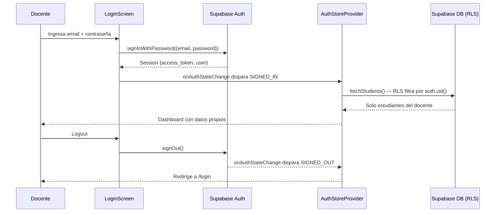

# Design Document: teacher-auth

## Overview

Reemplaza el sistema de login demo hardcodeado de EduLab por autenticación real con Supabase Auth (`signInWithPassword` + Google OAuth), e introduce aislamiento de datos por docente mediante la columna `teacher_id` y Row Level Security (RLS) en Supabase. Cada docente solo verá y modificará sus propios estudiantes, asignaciones y trabajos.

El cambio es aditivo: las tablas existentes reciben una columna `teacher_id` que apunta a `auth.uid()`, las políticas RLS filtran automáticamente en el servidor, y el cliente Next.js deja de depender de localStorage para la sesión.

---

## Architecture

```mermaid
graph TD
    A[LoginScreen] -->|email+password| B[supabase.auth.signInWithPassword]
    A -->|Google token| C[supabase.auth.signInWithIdToken]
    B --> D[Supabase Auth]
    C --> D
    D -->|session JWT| E[AuthStoreProvider]
    E -->|auth.uid()| F[supabase-store.ts]
    F -->|queries con teacher_id| G[(Supabase DB + RLS)]
    G -->|solo filas del docente| F
    E --> H[Dashboard / Screens]
    H -->|logout| I[supabase.auth.signOut]
    I --> E
```



---

## Components and Interfaces

### AuthStoreProvider

Reemplaza `DemoStoreProvider`. Gestiona la sesión de Supabase y expone el estado de autenticación a toda la app.

**Interface**:
```typescript
interface AuthStore {
  isReady: boolean
  session: SupabaseSession | null
  teacherId: string | null          // auth.uid() del docente autenticado
  profile: TeacherProfile | null
  institution: Institution
  courses: Course[]
  missions: Mission[]
  students: Student[]
  assignments: Assignment[]
  studentWorks: StudentWork[]
  robotIp: string

  // Auth
  loginWithPassword(email: string, password: string): Promise<AuthResult>
  loginWithGoogle(idToken: string): Promise<AuthResult>
  logout(): Promise<void>

  // Estudiantes
  loginStudentWithMissionCode(missionCode: string, studentId: string): StudentLoginResult
  addStudent(input: StudentInput): Promise<void>
  updateStudent(studentId: string, input: StudentInput): Promise<void>
  deleteStudent(studentId: string): Promise<void>
  importStudents(students: ImportedStudent[]): Promise<{ added: number; skipped: string[] }>

  // Asignaciones
  assignMission(input: AssignMissionInput): Promise<void>
  archiveAssignment(assignmentId: string): Promise<void>
  deleteAssignment(assignmentId: string): Promise<void>

  // Trabajos
  saveStudentWork(input: SaveStudentWorkInput): Promise<void>
  submitStudentWork(input: SubmitStudentWorkInput): Promise<void>

  // Perfil
  updateProfile(input: ProfileInput): Promise<void>

  // Robot
  setRobotIp(ip: string): void
}

type AuthResult = { ok: boolean; message?: string }
```

**Responsabilidades**:
- Suscribirse a `supabase.auth.onAuthStateChange` al montar
- Al `SIGNED_IN`: cargar datos del docente desde Supabase (filtrados por RLS)
- Al `SIGNED_OUT`: limpiar estado en memoria
- Propagar `teacherId = session.user.id` a todas las operaciones de escritura

---

### LoginScreen (actualizado)

Sin cambios visuales. Solo cambia la lógica interna: llama a `loginWithPassword` / `loginWithGoogle` del nuevo `AuthStoreProvider`.

```typescript
// Antes (hardcodeado)
loginWithPassword(email, password)  // compara con "demo2026"

// Después (Supabase Auth)
await supabase.auth.signInWithPassword({ email, password })
```

---

### supabase-store.ts (actualizado)

Todas las funciones de fetch reciben `teacherId` como parámetro y filtran por él. Las funciones de escritura incluyen `teacher_id` en el payload.

```typescript
// Fetch con filtro
export async function fetchStudents(teacherId: string): Promise<Student[]>
export async function fetchAssignments(teacherId: string): Promise<Assignment[]>
export async function fetchStudentWorks(teacherId: string): Promise<StudentWork[]>
export async function fetchProfile(teacherId: string): Promise<TeacherProfile | null>

// Upsert con teacher_id
export async function upsertStudent(student: Student, teacherId: string): Promise<void>
export async function upsertAssignment(assignment: Assignment, teacherId: string): Promise<void>
export async function upsertStudentWork(work: StudentWork, teacherId: string): Promise<void>
export async function upsertProfile(profile: TeacherProfile): Promise<void>
```

---

## Data Models

### Cambios en tablas de Supabase

```sql
-- Agregar teacher_id a las tablas que necesitan aislamiento
ALTER TABLE students        ADD COLUMN teacher_id UUID REFERENCES auth.users(id);
ALTER TABLE assignments     ADD COLUMN teacher_id UUID REFERENCES auth.users(id);
ALTER TABLE student_works   ADD COLUMN teacher_id UUID REFERENCES auth.users(id);
ALTER TABLE teacher_profiles ADD COLUMN teacher_id UUID REFERENCES auth.users(id);

-- Índices para performance
CREATE INDEX idx_students_teacher_id        ON students(teacher_id);
CREATE INDEX idx_assignments_teacher_id     ON assignments(teacher_id);
CREATE INDEX idx_student_works_teacher_id   ON student_works(teacher_id);
```

### Políticas RLS

```sql
-- Habilitar RLS en todas las tablas
ALTER TABLE students         ENABLE ROW LEVEL SECURITY;
ALTER TABLE assignments      ENABLE ROW LEVEL SECURITY;
ALTER TABLE student_works    ENABLE ROW LEVEL SECURITY;
ALTER TABLE teacher_profiles ENABLE ROW LEVEL SECURITY;

-- Política: docente solo ve/modifica sus propias filas
CREATE POLICY "teacher_isolation" ON students
  USING (teacher_id = auth.uid())
  WITH CHECK (teacher_id = auth.uid());

CREATE POLICY "teacher_isolation" ON assignments
  USING (teacher_id = auth.uid())
  WITH CHECK (teacher_id = auth.uid());

CREATE POLICY "teacher_isolation" ON student_works
  USING (teacher_id = auth.uid())
  WITH CHECK (teacher_id = auth.uid());

CREATE POLICY "teacher_own_profile" ON teacher_profiles
  USING (teacher_id = auth.uid())
  WITH CHECK (teacher_id = auth.uid());
```

### Tipos TypeScript actualizados

```typescript
// Student — agrega teacherId
type Student = {
  id: string
  teacherId: string          // nuevo — auth.uid() del docente
  institutionId: string
  courseId: string
  fullName: string
  email: string
  progress: StudentProgress
  currentMissionId?: string
  avatarUrl?: string
  createdAt: string
}

// Assignment — agrega teacherId
type Assignment = {
  id: string
  teacherId: string          // nuevo
  institutionId: string
  courseId: string
  missionId: string
  missionCode: string
  instructions?: string
  status: AssignmentStatus
  assignedAt: string
  assignedBy: string         // mantener por compatibilidad
  completedCount: number
  reviewCount: number
}

// StudentWork — agrega teacherId
type StudentWork = {
  id: string
  teacherId: string          // nuevo
  institutionId: string
  studentId: string
  assignmentId: string
  missionId: string
  workspaceState?: unknown
  stepIndex: number
  status: StudentWorkStatus
  updatedAt: string
  submittedAt?: string
}

// TeacherProfile — agrega teacherId
type TeacherProfile = {
  id: string
  teacherId: string          // nuevo — igual a auth.uid()
  institutionId: string
  fullName: string
  email: string
  biography: string
  avatarUrl?: string
}
```

---

## Key Functions with Formal Specifications

### `loginWithPassword(email, password)`

```typescript
async function loginWithPassword(
  email: string,
  password: string
): Promise<AuthResult>
```

**Preconditions:**
- `email` es string no vacío con formato de email válido
- `password` es string de al menos 8 caracteres

**Postconditions:**
- Si Supabase Auth retorna sesión: `result.ok === true`, `session` queda seteada en el store, `teacherId === session.user.id`
- Si Supabase Auth retorna error: `result.ok === false`, `result.message` contiene el mensaje de error, `session` permanece `null`
- No hay side effects sobre datos de estudiantes/asignaciones hasta que `onAuthStateChange` dispare `SIGNED_IN`

---

### `logout()`

```typescript
async function logout(): Promise<void>
```

**Preconditions:**
- Puede llamarse con o sin sesión activa

**Postconditions:**
- `supabase.auth.signOut()` fue invocado
- `session === null`
- `teacherId === null`
- `students`, `assignments`, `studentWorks` quedan vacíos en memoria
- El navegador no retiene tokens de sesión

---

### `fetchStudents(teacherId)`

```typescript
async function fetchStudents(teacherId: string): Promise<Student[]>
```

**Preconditions:**
- `teacherId` es un UUID válido correspondiente a un usuario autenticado en `auth.users`

**Postconditions:**
- Retorna solo filas donde `teacher_id = teacherId` (garantizado por RLS + filtro explícito)
- Si la query falla, retorna `[]` y loguea el error
- Nunca retorna filas de otros docentes

**Loop Invariants:** N/A (query única sin iteración en cliente)

---

### `upsertStudent(student, teacherId)`

```typescript
async function upsertStudent(student: Student, teacherId: string): Promise<void>
```

**Preconditions:**
- `student.id` es un UUID válido
- `teacherId === auth.uid()` del docente autenticado
- `student.courseId` existe en `demoCourses`

**Postconditions:**
- La fila en `students` tiene `teacher_id = teacherId`
- RLS impide que otro docente sobreescriba la fila
- Si la operación falla, el error se loguea pero no se lanza excepción (optimistic UI)

---

## Algorithmic Pseudocode

### Inicialización del AuthStoreProvider

```typescript
// Al montar el componente
useEffect(() => {
  // 1. Obtener sesión existente (si el usuario ya estaba logueado)
  const { data: { session } } = await supabase.auth.getSession()
  if (session) {
    await loadTeacherData(session.user.id)
  }
  setIsReady(true)

  // 2. Suscribirse a cambios de auth
  const { data: { subscription } } = supabase.auth.onAuthStateChange(
    async (event, session) => {
      if (event === 'SIGNED_IN' && session) {
        await loadTeacherData(session.user.id)
      }
      if (event === 'SIGNED_OUT') {
        clearTeacherData()
      }
    }
  )

  return () => subscription.unsubscribe()
}, [])

async function loadTeacherData(teacherId: string) {
  const [students, assignments, works, profile] = await Promise.all([
    fetchStudents(teacherId),
    fetchAssignments(teacherId),
    fetchStudentWorks(teacherId),
    fetchProfile(teacherId),
  ])
  setStudents(students)
  setAssignments(assignments)
  setStudentWorks(works)
  setProfile(profile ?? buildDefaultProfile(teacherId))
  setTeacherId(teacherId)
}

function clearTeacherData() {
  setSession(null)
  setTeacherId(null)
  setStudents([])
  setAssignments([])
  setStudentWorks([])
  setProfile(null)
}
```

### Login con email/contraseña

```typescript
async function loginWithPassword(email: string, password: string): Promise<AuthResult> {
  const { data, error } = await supabase.auth.signInWithPassword({ email, password })

  if (error) {
    return { ok: false, message: mapSupabaseError(error.message) }
  }

  // onAuthStateChange dispara SIGNED_IN automáticamente
  // No es necesario setear session manualmente aquí
  return { ok: true }
}

function mapSupabaseError(message: string): string {
  if (message.includes('Invalid login credentials')) {
    return 'Correo o contraseña incorrectos.'
  }
  if (message.includes('Email not confirmed')) {
    return 'Debes confirmar tu correo antes de ingresar.'
  }
  return 'No se pudo iniciar sesión. Intenta de nuevo.'
}
```

### Login con Google OAuth

```typescript
async function loginWithGoogle(idToken: string): Promise<AuthResult> {
  const { data, error } = await supabase.auth.signInWithIdToken({
    provider: 'google',
    token: idToken,
  })

  if (error) {
    return { ok: false, message: 'No se pudo iniciar sesión con Google.' }
  }

  return { ok: true }
}
```

### Crear estudiante con teacher_id

```typescript
async function addStudent(input: StudentInput): Promise<void> {
  if (!teacherId) return  // guard: no debería ocurrir si UI está protegida

  const newStudent: Student = {
    id: crypto.randomUUID(),
    teacherId,                          // ← siempre el docente autenticado
    institutionId: institution.id,
    courseId: input.courseId,
    fullName: input.fullName.trim(),
    email: input.email.trim().toLowerCase(),
    progress: 'En curso',
    avatarUrl: input.avatarUrl,
    createdAt: new Date().toISOString(),
  }

  setStudents(current => [newStudent, ...current])  // optimistic update
  await upsertStudent(newStudent, teacherId)
}
```

---

## Example Usage

```typescript
// 1. Login con email/contraseña
const { loginWithPassword } = useAuthStore()
const result = await loginWithPassword('docente@colegio.edu', 'miClave123')
if (!result.ok) showError(result.message)

// 2. Login con Google (desde LoginScreen)
async function handleGoogleSuccess(credentialResponse: CredentialResponse) {
  if (!credentialResponse.credential) return
  const result = await loginWithGoogle(credentialResponse.credential)
  if (!result.ok) showError(result.message)
}

// 3. Agregar estudiante (teacher_id se inyecta automáticamente)
const { addStudent } = useAuthStore()
await addStudent({ fullName: 'Ana García', email: 'ana@colegio.edu', courseId: 'course-10a' })

// 4. Logout
const { logout } = useAuthStore()
await logout()
// → sesión limpiada, redirige a /login
```

---

## Error Handling

### Error: Credenciales inválidas

**Condición**: `supabase.auth.signInWithPassword` retorna `Invalid login credentials`
**Respuesta**: Mostrar "Correo o contraseña incorrectos." en el formulario
**Recuperación**: El usuario puede reintentar; no hay bloqueo automático (Supabase maneja rate limiting)

### Error: Sesión expirada

**Condición**: El JWT del docente expira mientras usa la app
**Respuesta**: `onAuthStateChange` dispara `TOKEN_REFRESHED` o `SIGNED_OUT`
**Recuperación**: Supabase refresca el token automáticamente si hay refresh token válido; si no, redirige a login

### Error: RLS rechaza operación

**Condición**: Un docente intenta leer/escribir filas de otro docente (no debería ocurrir en uso normal)
**Respuesta**: Supabase retorna error `42501` (insufficient privilege); la función loguea el error y retorna `[]` o no-op
**Recuperación**: No se expone el error al usuario; la UI muestra datos vacíos

### Error: Fallo de red en upsert

**Condición**: La operación de escritura falla por red
**Respuesta**: El estado optimista ya fue aplicado en memoria; se loguea el error
**Recuperación**: Al recargar la página, los datos se re-sincronizan desde Supabase

---

## Testing Strategy

### Unit Testing

- `mapSupabaseError(message)` — mapea mensajes de error de Supabase a mensajes en español
- `buildDefaultProfile(teacherId)` — construye perfil vacío con el teacherId correcto
- Row mappers: `rowToStudent`, `studentToRow` — verificar que `teacher_id` se mapea correctamente a `teacherId`

### Property-Based Testing

**Librería**: `fast-check` (ya instalada en el proyecto)

**Propiedad 1**: Para cualquier docente autenticado, `fetchStudents(teacherId)` nunca retorna estudiantes con `teacherId` diferente al parámetro.

```typescript
fc.assert(fc.property(
  fc.uuid(),
  fc.array(arbitraryStudent()),
  (teacherId, students) => {
    const filtered = students.filter(s => s.teacherId === teacherId)
    // Simular RLS: todos los resultados deben pertenecer al docente
    return filtered.every(s => s.teacherId === teacherId)
  }
))
```

**Propiedad 2**: `loginWithPassword` con cualquier email/contraseña inválidos siempre retorna `{ ok: false }`.

**Propiedad 3**: `addStudent` siempre asigna `teacherId` igual al `auth.uid()` del docente autenticado, independientemente del input.

### Integration Testing

- Login exitoso con Supabase Auth (usando credenciales de test)
- Verificar que después del login, `fetchStudents` solo retorna datos del docente autenticado
- Verificar que `logout` limpia la sesión y redirige a `/login`
- Verificar que Google OAuth fluye correctamente con `signInWithIdToken`

---

## Performance Considerations

- Los índices en `teacher_id` garantizan que las queries RLS sean O(log n) en lugar de full table scan
- `Promise.all` en `loadTeacherData` paraleliza las 4 queries de carga inicial
- El cliente Supabase maneja connection pooling automáticamente
- No se necesita caché adicional: los datos se cargan una vez por sesión y se actualizan optimísticamente

---

## Security Considerations

- **RLS como segunda línea de defensa**: aunque el cliente filtre por `teacherId`, RLS en el servidor garantiza aislamiento incluso si el cliente es comprometido
- **No exponer `teacher_id` en URLs**: usar siempre `auth.uid()` del servidor, nunca confiar en IDs del cliente
- **Tokens JWT**: Supabase maneja rotación automática; el `access_token` expira en 1 hora por defecto
- **Google OAuth**: usar `signInWithIdToken` (server-side validation) en lugar de solo decodificar el JWT en el cliente
- **Migración de datos existentes**: los registros sin `teacher_id` quedarán inaccesibles por RLS hasta que se migren manualmente desde el dashboard de Supabase

---

## Dependencies

- `@supabase/supabase-js` ^2.103.0 — ya instalado, incluye `supabase.auth.*`
- `@react-oauth/google` ^0.13.5 — ya instalado, provee `CredentialResponse` con `idToken`
- Supabase proyecto configurado con:
  - Auth habilitado (email/password + Google OAuth)
  - Google OAuth configurado en Supabase Dashboard → Authentication → Providers
  - Variables de entorno: `NEXT_PUBLIC_SUPABASE_URL`, `NEXT_PUBLIC_SUPABASE_ANON_KEY`

---

## Correctness Properties

*A property is a characteristic or behavior that should hold true across all valid executions of a system — essentially, a formal statement about what the system should do. Properties serve as the bridge between human-readable specifications and machine-verifiable correctness guarantees.*

### Property 1: Credenciales inválidas siempre retornan ok=false

*For any* combinación de email y contraseña que Supabase Auth rechace, `loginWithPassword` SHALL retornar `{ ok: false }` con un mensaje de error no vacío.

**Validates: Requirements 1.2**

---

### Property 2: teacherId siempre refleja auth.uid() tras autenticación exitosa

*For any* autenticación exitosa (email/contraseña o Google OAuth), el `teacherId` expuesto por `AuthStoreProvider` SHALL ser igual al `user.id` retornado por Supabase en la sesión.

**Validates: Requirements 1.6, 2.4**

---

### Property 3: Aislamiento de datos — fetch nunca retorna filas de otro docente

*For any* `teacherId` válido, todas las filas retornadas por `fetchStudents`, `fetchAssignments` y `fetchStudentWorks` SHALL tener `teacherId` igual al parámetro recibido; ninguna fila de otro docente SHALL aparecer en los resultados.

**Validates: Requirements 3.2, 6.5**

---

### Property 4: Escritura siempre inyecta el teacherId del docente autenticado

*For any* `StudentInput`, `AssignMissionInput` o `SaveStudentWorkInput`, el registro persistido por `addStudent`, `assignMission` o `saveStudentWork` SHALL tener `teacher_id` igual al `teacherId` del docente autenticado en ese momento.

**Validates: Requirements 4.1, 4.2, 4.3**

---

### Property 5: Logout limpia completamente el estado en memoria

*For any* estado previo del `AuthStoreProvider` (con cualquier cantidad de estudiantes, asignaciones y trabajos cargados), invocar `logout()` SHALL resultar en `session === null`, `teacherId === null`, `students.length === 0`, `assignments.length === 0`, `studentWorks.length === 0` y `profile === null`.

**Validates: Requirements 7.2, 7.3, 7.4**

---

### Property 6: Round-trip de serialización de Student preserva todos los campos

*For any* objeto `Student` válido (incluyendo `teacherId`), aplicar `studentToRow` seguido de `rowToStudent` SHALL producir un objeto equivalente al original en todos sus campos.

**Validates: Requirements 9.5**

---

### Property 7: Round-trip de serialización de Assignment preserva todos los campos

*For any* objeto `Assignment` válido (incluyendo `teacherId`), aplicar `assignmentToRow` seguido de `rowToAssignment` SHALL producir un objeto equivalente al original en todos sus campos.

**Validates: Requirements 9.6**

---

### Property 8: mapSupabaseError retorna mensaje en español para cualquier input

*For any* string de error desconocido (que no coincida con los patrones conocidos), `mapSupabaseError` SHALL retornar el mensaje genérico `"No se pudo iniciar sesión. Intenta de nuevo."` en lugar de exponer el mensaje técnico original.

**Validates: Requirements 1.5**
