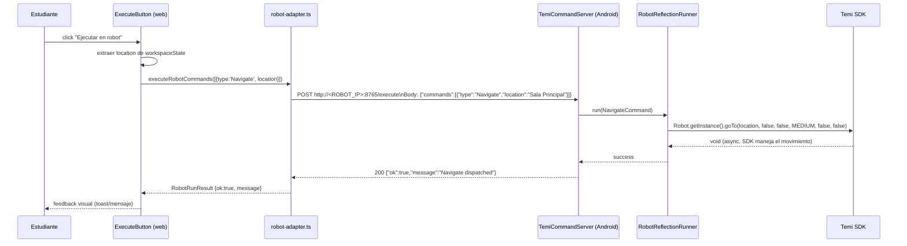
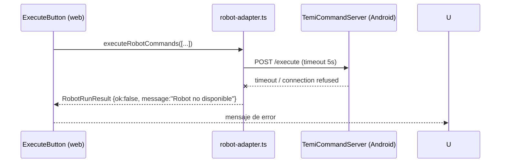

# Design Document: temi-execute-navigate

## Overview

Esta feature agrega un botón "Ejecutar en robot" al editor Blockly de la web (Next.js). Al presionarlo, la web extrae el bloque `temi_move` del workspace, construye un comando `Navigate` y lo envía vía HTTP POST al robot Temi. La app Android recibe el comando en un nuevo endpoint HTTP y llama a `robot.goTo(...)` usando reflexión sobre el SDK de Temi (igual que ya se hace para `getLocations`).

El alcance de esta iteración es exclusivamente el bloque `temi_move` (Navigate). Los bloques `say`, `show` y `audio` se integrarán en iteraciones posteriores con el mismo patrón.

## Architecture

```mermaid
graph TD
    subgraph "Web (Next.js)"
        BW[BlocklyWorkspace]
        EB[ExecuteButton]
        RA[robot-adapter.ts]
    end

    subgraph "Robot Android (puerto 8765)"
        LS[TemiLocationServer\nexistente - GET /locations]
        CS[TemiCommandServer\nnuevo - POST /execute]
        RR[RobotReflectionRunner]
    end

    subgraph "Temi SDK"
        SDK[Robot.getInstance\n.goTo\(...\)]
    end

    BW -->|workspaceState + sequence| EB
    EB -->|executeNavigate\(location\)| RA
    RA -->|POST /execute\n{type:'Navigate', location}| CS
    CS --> RR
    RR -->|reflexión| SDK
```

## Sequence Diagrams

### Flujo principal: ejecutar Navigate



### Flujo de error: robot no disponible



## Components and Interfaces

### Componente Web: `ExecuteButton`

**Purpose**: Botón que aparece debajo del editor Blockly. Extrae el primer bloque `temi_move` del workspace, llama al adapter y muestra feedback.

**Interface** (TypeScript):
```typescript
interface ExecuteButtonProps {
  workspaceState: unknown;   // estado serializado del workspace Blockly
  sequence: string[];        // tipos de bloques en orden
  disabled?: boolean;        // true si no hay bloque temi_move
}
```

**Responsabilidades**:
- Leer `workspaceState` para extraer el campo `LOCATION` del bloque `temi_move`
- Deshabilitar el botón si no hay bloque `temi_move` en la secuencia
- Llamar a `executeRobotCommands` del adapter
- Mostrar estado de carga y resultado (ok / error)

---

### Módulo Web: `robot-adapter.ts` (extensión)

**Purpose**: Añadir la función `executeRobotCommands` al adapter existente.

**Interface** (TypeScript):
```typescript
type NavigateCommand = {
  type: "Navigate";
  location: string;
};

// Por ahora solo Navigate; se extenderá con Say, Show, Audio
type RobotExecuteCommand = NavigateCommand;

type RobotRunResult = {
  ok: boolean;
  message: string;
};

async function executeRobotCommands(
  commands: RobotExecuteCommand[]
): Promise<RobotRunResult>
```

**Responsabilidades**:
- Hacer POST a `${ROBOT_API_URL}/execute` con body `{ commands }`
- Timeout de 5 segundos
- Devolver `{ ok: false, message }` en caso de error de red

---

### Componente Android: `TemiCommandServer`

**Purpose**: Nuevo servidor HTTP en el mismo puerto 8765 (o extender `TemiLocationServer`) que atiende `POST /execute`.

**Interface** (Kotlin):
```kotlin
interface CommandServer {
    fun start()
    fun stop()
}

data class ExecuteRequest(
    val commands: List<RobotCommand>
)

sealed class RobotCommand {
    data class Navigate(val location: String) : RobotCommand()
    // Say, Show, Audio se añadirán después
}
```

**Responsabilidades**:
- Parsear el body JSON del POST `/execute`
- Delegar en `RobotReflectionRunner`
- Responder `200 {"ok":true,"message":"..."}` o `400`/`500` según corresponda
- Incluir header `Access-Control-Allow-Origin: *` (igual que `TemiLocationServer`)

---

### Componente Android: `RobotReflectionRunner`

**Purpose**: Ejecutar comandos sobre el SDK de Temi usando reflexión (mismo patrón que `fetchLocationsViaReflection`).

**Interface** (Kotlin):
```kotlin
interface RobotCommandRunner {
    fun run(command: RobotCommand): Result<Unit>
}

class RobotReflectionRunner @Inject constructor() : RobotCommandRunner {
    override fun run(command: RobotCommand): Result<Unit>
}
```

**Responsabilidades**:
- Para `Navigate`: llamar `Robot.getInstance().goTo(location, false, false, SpeedLevel.MEDIUM, false, false)` vía reflexión
- Devolver `Result.failure(...)` si `Robot.getInstance()` es null o la reflexión falla
- Loggear errores con el mismo patrón que `TemiLocationServer`

## Data Models

### Payload HTTP: POST /execute

```typescript
// Request body (JSON)
type ExecuteRequestBody = {
  commands: Array<{
    type: "Navigate";
    location: string;
  }>;
};

// Response body (JSON)
type ExecuteResponseBody = {
  ok: boolean;
  message: string;
};
```

**Reglas de validación**:
- `commands` debe ser un array no vacío
- Para `Navigate`: `location` debe ser string no vacío
- Si el array contiene tipos desconocidos, se ignoran (forward-compatible)

### Extracción de location desde workspaceState Blockly

El workspace serializado de Blockly tiene la forma:
```json
{
  "blocks": {
    "blocks": [
      {
        "type": "temi_start",
        "next": {
          "block": {
            "type": "temi_move",
            "fields": { "LOCATION": "Sala Principal" }
          }
        }
      }
    ]
  }
}
```

La función `extractNavigateStep` ya existe en `src/lib/mission-program.ts` y extrae el campo `LOCATION` de un bloque `temi_move`.

## Key Functions with Formal Specifications

### `executeRobotCommands(commands)` — robot-adapter.ts

```typescript
async function executeRobotCommands(
  commands: RobotExecuteCommand[]
): Promise<RobotRunResult>
```

**Preconditions:**
- `commands` es un array con al menos un elemento
- Cada `NavigateCommand` tiene `location` no vacío
- `ROBOT_API_URL` está configurado (o usa el default `http://localhost:8765`)

**Postconditions:**
- Siempre devuelve un `RobotRunResult` (nunca lanza excepción)
- Si la respuesta HTTP es 2xx: `result.ok === true`
- Si hay error de red o timeout: `result.ok === false` con mensaje descriptivo
- Si la respuesta HTTP es 4xx/5xx: `result.ok === false`

---

### `RobotReflectionRunner.run(Navigate)` — Android

```kotlin
fun run(command: RobotCommand.Navigate): Result<Unit>
```

**Preconditions:**
- `command.location` es un string no vacío
- El SDK de Temi está disponible en el classpath

**Postconditions:**
- Si `Robot.getInstance()` es null: devuelve `Result.failure(IllegalStateException)`
- Si la reflexión falla: devuelve `Result.failure(exception)`
- Si `goTo` se invoca correctamente: devuelve `Result.success(Unit)`
- No bloquea el hilo del servidor HTTP (el SDK maneja el movimiento de forma asíncrona)

**Loop Invariants:** N/A (no hay bucles)

## Algorithmic Pseudocode

### Algoritmo: Ejecutar Navigate desde la web

```pascal
ALGORITHM executeNavigate(workspaceState, sequence)
INPUT: workspaceState (Blockly serialized state), sequence (string[])
OUTPUT: RobotRunResult

BEGIN
  IF "temi_move" NOT IN sequence THEN
    RETURN {ok: false, message: "No hay bloque 'ir a' en el programa"}
  END IF

  location ← extractLocationFromWorkspace(workspaceState)

  IF location IS EMPTY THEN
    RETURN {ok: false, message: "El bloque 'ir a' no tiene ubicación seleccionada"}
  END IF

  command ← {type: "Navigate", location: location}
  result ← executeRobotCommands([command])  // HTTP POST con timeout 5s

  RETURN result
END
```

### Algoritmo: Manejar POST /execute en Android

```pascal
ALGORITHM handleExecuteRequest(httpRequest)
INPUT: httpRequest (HTTP POST /execute)
OUTPUT: HTTP Response

BEGIN
  body ← parseJsonBody(httpRequest)

  IF body IS NULL OR body.commands IS EMPTY THEN
    RETURN HTTP 400 {ok: false, message: "Bad request"}
  END IF

  FOR each command IN body.commands DO
    IF command.type = "Navigate" THEN
      result ← robotReflectionRunner.run(Navigate(command.location))

      IF result IS FAILURE THEN
        RETURN HTTP 500 {ok: false, message: result.error.message}
      END IF
    ELSE
      // Tipo desconocido: ignorar (forward-compatible)
    END IF
  END FOR

  RETURN HTTP 200 {ok: true, message: "Navigate dispatched"}
END
```

### Algoritmo: goTo vía reflexión

```pascal
ALGORITHM goToViaReflection(location)
INPUT: location (String)
OUTPUT: Result<Unit>

BEGIN
  rClass ← Class.forName("com.robotemi.sdk.Robot")
  robot ← rClass.getMethod("getInstance").invoke(null)

  IF robot IS NULL THEN
    RETURN Failure(IllegalStateException("Robot instance not available"))
  END IF

  speedLevelClass ← Class.forName("com.robotemi.sdk.navigation.model.SpeedLevel")
  mediumLevel ← speedLevelClass.getField("MEDIUM").get(null)

  goToMethod ← rClass.getMethod(
    "goTo",
    String::class.java,
    Boolean::class.java,
    Boolean::class.java,
    speedLevelClass,
    Boolean::class.java,
    Boolean::class.java
  )

  goToMethod.invoke(robot, location, false, false, mediumLevel, false, false)

  RETURN Success(Unit)
END
```

## Example Usage

### Web: añadir el botón en `StudentFreePlayScreen`

```typescript
// En student-free-play-screen.tsx
const [workspaceState, setWorkspaceState] = useState<unknown>(undefined);
const [sequence, setSequence] = useState<string[]>([]);

<BlocklyWorkspace
  onChange={({ sequence: s, workspaceState: ws }) => {
    setSequence(s);
    setWorkspaceState(ws);
  }}
/>
<ExecuteButton workspaceState={workspaceState} sequence={sequence} />
```

### Web: llamada al adapter

```typescript
// En robot-adapter.ts
const result = await executeRobotCommands([
  { type: "Navigate", location: "Sala Principal" }
]);
// result = { ok: true, message: "Navigate dispatched" }
```

### Android: POST /execute

```
POST http://192.168.1.42:8765/execute
Content-Type: application/json

{"commands":[{"type":"Navigate","location":"Sala Principal"}]}

→ 200 OK
{"ok":true,"message":"Navigate dispatched"}
```

## Correctness Properties

1. **Idempotencia de extracción**: Para cualquier `workspaceState` válido con un bloque `temi_move`, `extractLocationFromWorkspace` siempre devuelve el mismo `location` sin efectos secundarios.

2. **Nunca lanza excepción**: `executeRobotCommands` siempre devuelve un `RobotRunResult`; cualquier error de red, timeout o respuesta inesperada se captura y se refleja en `result.ok === false`.

3. **Reflexión segura**: `RobotReflectionRunner.run` nunca lanza excepción no controlada; todos los errores de reflexión se envuelven en `Result.failure(...)`.

4. **CORS habilitado**: Todas las respuestas del servidor Android incluyen `Access-Control-Allow-Origin: *`, permitiendo que la web (en cualquier origen) llame al robot.

5. **Forward-compatible**: Comandos de tipo desconocido en el array `commands` son ignorados sin error, permitiendo que versiones futuras de la web envíen `Say`, `Show`, `Audio` sin romper la app Android actual.

6. **Botón deshabilitado sin bloque**: El `ExecuteButton` está deshabilitado (`disabled={true}`) cuando `sequence` no contiene `"temi_move"`, evitando llamadas HTTP innecesarias.

## Error Handling

### Error: Robot no disponible (timeout / connection refused)

**Condición**: La web no puede conectar al puerto 8765 del robot en 5 segundos.
**Respuesta**: `executeRobotCommands` devuelve `{ ok: false, message: "Robot no disponible" }`.
**Recovery**: El botón vuelve a su estado normal; el estudiante puede reintentar.

### Error: `Robot.getInstance()` retorna null

**Condición**: El SDK de Temi no está inicializado en el momento de la llamada.
**Respuesta**: `RobotReflectionRunner.run` devuelve `Result.failure(...)`, el servidor responde `500`.
**Recovery**: La web muestra el mensaje de error; no hay acción automática de reintento.

### Error: Ubicación vacía o no encontrada

**Condición**: El bloque `temi_move` no tiene `LOCATION` configurado, o la ubicación no existe en el mapa del robot.
**Respuesta web**: El botón se deshabilita o muestra advertencia antes de enviar.
**Respuesta Android**: El SDK de Temi maneja internamente la ubicación no encontrada (callback de error del SDK, fuera del alcance de esta iteración).

### Error: Body JSON malformado

**Condición**: El POST llega con body inválido.
**Respuesta**: El servidor Android responde `400 { ok: false, message: "Bad request" }`.

## Testing Strategy

### Unit Testing

- `extractLocationFromWorkspace`: verificar extracción correcta de `LOCATION` desde distintos estados de workspace (con bloque, sin bloque, campo vacío).
- `executeRobotCommands`: mockear `fetch`; verificar que construye el body correcto, maneja timeout y errores HTTP.
- `ExecuteButton`: verificar que se deshabilita sin `temi_move`, que llama al adapter con la location correcta, que muestra feedback.
- `RobotReflectionRunner`: mockear reflexión; verificar manejo de `getInstance() = null` y de `goTo` exitoso.

### Property-Based Testing

**Librería**: fast-check (web), JUnit + Kotest (Android)

- Para cualquier `workspaceState` con un bloque `temi_move` con `location` no vacío, `executeRobotCommands` nunca lanza excepción.
- Para cualquier string `location` no vacío, `RobotReflectionRunner.run(Navigate(location))` devuelve `Result.success` o `Result.failure` (nunca lanza).
- Para cualquier array `commands` (incluyendo tipos desconocidos), el servidor Android responde siempre con JSON válido.

### Integration Testing

- Levantar un servidor HTTP mock en Android que simule el endpoint `/execute` y verificar que la web envía el payload correcto.
- Verificar el flujo completo: click en botón → POST → respuesta → feedback visual.

## Performance Considerations

- El timeout de 5 segundos en `executeRobotCommands` es suficiente para una red local (LAN/WiFi del aula). No se requiere retry automático en esta iteración.
- El servidor Android atiende cada request en un hilo separado (igual que `TemiLocationServer`), por lo que no bloquea la UI del robot.
- `goTo` del SDK de Temi es asíncrono; el servidor responde inmediatamente tras despachar el comando, sin esperar a que el robot llegue al destino.

## Security Considerations

- El servidor HTTP del robot no tiene autenticación (igual que el endpoint `/locations` existente). Esto es aceptable en el contexto de red local de aula controlada.
- El header `Access-Control-Allow-Origin: *` es intencional para permitir la web desde cualquier origen en la red local.
- No se exponen datos sensibles; solo se acepta un nombre de ubicación string.

## Dependencies

- **Web**: No se añaden dependencias nuevas. Se extiende `robot-adapter.ts` existente.
- **Android**: No se añaden dependencias nuevas. Se usa reflexión sobre el SDK de Temi ya presente (`com.robotemi.sdk.Robot`), Hilt para DI, y la infraestructura de servidor HTTP raw ya establecida en `TemiLocationServer`.
- **SDK de Temi**: versión 1.137.1. Firma del método objetivo:
  ```
  void goTo(String location, boolean backwards, boolean noBypass,
            SpeedLevel speedLevel, boolean highAccuracyArrival, boolean noRotationAtEnd)
  ```
