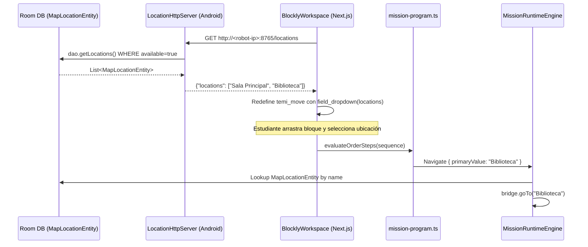

# Design Document: temi-location-block

## Overview

Este documento describe el diseño técnico para reemplazar el bloque Blockly `temi_move` ("avanzar N pasos") por un bloque "ir a [ubicación ▼]" que muestra un dropdown con las ubicaciones reales del mapa del robot Temi V3.

El cambio requiere un canal de comunicación nuevo entre la app Android (`apps/robot-temi`) y la app web (Next.js): la app Android expone las ubicaciones disponibles del mapa a través de un servidor HTTP embebido, y la app web las consulta al inicializar el editor Blockly.

### Alcance del cambio

| Capa | Cambio |
|------|--------|
| Android (`apps/robot-temi`) | Nueva clase `LocationHttpServer.kt` en `runtime/` |
| Web (`src/`) | Nueva función `fetchRobotLocations()` en `robot-adapter.ts`; redefinición del bloque `temi_move` en `blockly-workspace.tsx` |
| Lógica de programa | Actualización de `orderStepsProgram` en `mission-program.ts` |

---

## Architecture

El flujo de datos sigue este camino:



### Decisión de diseño: servidor HTTP embebido vs. WebSocket vs. Intent

Se eligió un servidor HTTP embebido (`com.sun.net.httpserver.HttpServer`) porque:
- Disponible en Android sin dependencias extra (parte del JDK estándar incluido en Android)
- La web app ya usa `fetch()` — no requiere cambios de protocolo
- Stateless y simple: un único endpoint GET, sin estado de sesión
- CORS trivial con un header estático

Alternativas descartadas:
- **WebSocket**: overhead innecesario para una consulta de solo lectura al inicio
- **Android Intent / Deep Link**: no funciona cross-origin desde una web app en el navegador del robot
- **Hardcodear ubicaciones**: rompe el requisito de usar datos reales del mapa

---

## Components and Interfaces

### 1. `LocationHttpServer` (Android — nuevo)

**Ubicación:** `apps/robot-temi/app/src/main/java/com/esbot/edulab/robot/runtime/LocationHttpServer.kt`

**Responsabilidad:** Escuchar en el puerto 8765 y responder con la lista de ubicaciones disponibles en formato JSON.

```kotlin
class LocationHttpServer(private val dao: RobotDao) {
    private var server: HttpServer? = null

    fun start() { /* inicia HttpServer en puerto 8765 */ }
    fun stop()  { /* detiene el servidor */ }

    // Handler interno: lee dao.getLocations(), filtra available=true, serializa a JSON
}
```

**Contrato del endpoint:**

| Campo | Valor |
|-------|-------|
| Método | `GET` |
| Path | `/locations` |
| Puerto | `8765` |
| Respuesta | `{"locations": ["Nombre1", "Nombre2"]}` |
| HTTP status | `200` siempre |
| Headers | `Content-Type: application/json`, `Access-Control-Allow-Origin: *` |

**Integración con `MissionRuntimeEngine`:**

```kotlin
// En MissionRuntimeEngine.boot():
locationServer.start()

// En cleanup / resetToStandby():
locationServer.stop()
```

**Integración con `AppContainer`:**

```kotlin
val locationServer = LocationHttpServer(database.robotDao())
val runtimeEngine = MissionRuntimeEngine(repository, bridge, locationServer)
```

### 2. `fetchRobotLocations` (Web — nuevo)

**Ubicación:** `src/lib/robot-adapter.ts`

```typescript
const ROBOT_API_URL = process.env.NEXT_PUBLIC_ROBOT_API_URL ?? "http://localhost:8765";
const FALLBACK_LOCATIONS = ["Sala Principal"];

export async function fetchRobotLocations(): Promise<string[]> {
  try {
    const controller = new AbortController();
    const timeout = setTimeout(() => controller.abort(), 3000);
    const res = await fetch(`${ROBOT_API_URL}/locations`, { signal: controller.signal });
    clearTimeout(timeout);
    const data = await res.json() as { locations: string[] };
    return data.locations.length > 0 ? data.locations : FALLBACK_LOCATIONS;
  } catch {
    return FALLBACK_LOCATIONS;
  }
}
```

### 3. `BlocklyWorkspace` — redefinición de `temi_move` (Web — modificado)

**Ubicación:** `src/components/blockly-workspace.tsx`

El bloque `temi_move` se redefine con `field_dropdown` en lugar de `field_number`:

```typescript
// Antes:
{
  type: "temi_move",
  message0: "avanzar %1 pasos",
  args0: [{ type: "field_number", name: "STEPS", value: 2, min: 1, max: 5 }],
  ...
}

// Después:
{
  type: "temi_move",
  message0: "ir a %1",
  args0: [{
    type: "field_dropdown",
    name: "LOCATION",
    options: locations.map(l => [l, l])  // [display, value]
  }],
  ...
}
```

La función `defineTemiBlocks` recibe el array de ubicaciones como parámetro. El `useEffect` de inicialización llama a `fetchRobotLocations()` antes de invocar `defineTemiBlocks`.

**Fallback:** Si `fetchRobotLocations()` falla o retorna vacío, se usa `[["Sala Principal", "Sala Principal"]]`.

### 4. `mission-program.ts` — actualización de label (Web — modificado)

```typescript
// Antes:
{ type: "temi_move", label: "Avanzar 2 pasos", helper: "Haz que Temi avance antes de hablar." }

// Después:
{ type: "temi_move", label: "Ir a ubicación", helper: "Haz que Temi navegue a una ubicación del mapa." }
```

La evaluación de `evaluateOrderSteps` no cambia — sigue comparando por `type`, no por el valor del campo.

### 5. `MissionRuntimeEngine` — `executeNavigate` (Android — sin cambios funcionales)

El método `executeNavigate` ya implementa la lógica correcta:
- Busca la ubicación por nombre en `locations` donde `available = true`
- Si no la encuentra, llama a `showRecoverableError` con `studentCanResolve = false, autoRetryPlanned = false`
- Si la encuentra, llama a `bridge.goTo(resolvedLocation.name)`
- Si `goTo` falla, llama a `showRecoverableError` con `autoRetryPlanned = true`

No se requieren cambios en este método.

---

## Data Models

### JSON de respuesta del Location_Server

```json
{
  "locations": ["Biblioteca", "Salon 5A", "Laboratorio"]
}
```

Serialización manual en Kotlin (sin dependencias extra):

```kotlin
fun List<String>.toLocationsJson(): String {
    val items = joinToString(",") { "\"${it.replace("\"", "\\\"")}\"" }
    return "{\"locations\":[$items]}"
}
```

### Estado serializado del workspace Blockly (campo LOCATION)

Blockly serializa los campos de un bloque en el JSON de estado. Para `temi_move` con `field_dropdown`:

```json
{
  "blocks": {
    "blocks": [{
      "type": "temi_move",
      "fields": {
        "LOCATION": "Biblioteca"
      }
    }]
  }
}
```

### Compatibilidad hacia atrás

El formato antiguo tenía `"fields": { "STEPS": 2 }`. El `try/catch` existente en `loadBlockly` ya captura cualquier excepción de deserialización, por lo que los workspaces con el formato antiguo se ignoran silenciosamente sin romper la UI.

---

## Correctness Properties

*A property is a characteristic or behavior that should hold true across all valid executions of a system — essentially, a formal statement about what the system should do. Properties serve as the bridge between human-readable specifications and machine-verifiable correctness guarantees.*

### Property 1: Serialización JSON solo incluye ubicaciones disponibles

*For any* lista de `MapLocationEntity` con mezcla de `available = true` y `available = false`, la función de serialización del `LocationHttpServer` SHALL producir un JSON cuyo array `locations` contenga únicamente los nombres de las entidades con `available = true`.

**Validates: Requirements 1.2, 1.3**

---

### Property 2: El servidor refleja el estado actual de la base de datos

*For any* dos listas de ubicaciones distintas A y B, si el servidor sirve la lista A y luego la base de datos se actualiza a B (vía `refreshDiagnostics`), la siguiente petición al endpoint SHALL retornar la lista B.

**Validates: Requirements 1.5**

---

### Property 3: Las ubicaciones de la API se almacenan íntegramente en el estado del componente

*For any* array no vacío de strings retornado por la `Location_API`, el estado local del `BlocklyWorkspace` después de la inicialización SHALL contener exactamente ese array.

**Validates: Requirements 2.3**

---

### Property 4: El dropdown refleja exactamente la lista de ubicaciones

*For any* lista de ubicaciones de longitud N ≥ 1, las opciones del `field_dropdown` del bloque `temi_move` SHALL tener exactamente N entradas, y cada opción SHALL tener como valor el nombre de la ubicación correspondiente.

**Validates: Requirements 3.2**

---

### Property 5: Round-trip de serialización del workspace preserva LOCATION

*For any* nombre de ubicación válido seleccionado en el `Location_Dropdown`, serializar el workspace con `Blockly.serialization.workspaces.save()` y luego cargarlo con `Blockly.serialization.workspaces.load()` SHALL producir un bloque `temi_move` con el mismo valor en el campo `LOCATION`.

**Validates: Requirements 6.1, 6.2, 6.3**

---

### Property 6: Extracción del campo LOCATION genera Navigate con primaryValue correcto

*For any* nombre de ubicación no vacío en el campo `LOCATION` de un bloque `temi_move`, el `MissionProgram` SHALL generar un paso de tipo `Navigate` cuyo `primaryValue` sea exactamente ese nombre.

**Validates: Requirements 4.1, 4.2**

---

### Property 7: Lookup de ubicación en executeNavigate es correcto

*For any* lista de `MapLocationEntity` y cualquier nombre de ubicación, `executeNavigate` SHALL llamar a `bridge.goTo` con el nombre exacto de la entidad si y solo si existe una entidad con ese nombre (case-insensitive) y `available = true`; en caso contrario SHALL llamar a `showRecoverableError` con `studentCanResolve = false` y `autoRetryPlanned = false`.

**Validates: Requirements 5.1, 5.2, 5.3**

---

## Error Handling

### Android — `LocationHttpServer`

| Situación | Comportamiento |
|-----------|---------------|
| `dao.getLocations()` lanza excepción | Responder `{"locations": []}` con HTTP 200; loguear con `Log.w` |
| Puerto 8765 ya en uso | Loguear error con `Log.e`; el servidor no arranca (la web usará fallback) |
| Petición a path desconocido | Responder HTTP 404 |

### Web — `fetchRobotLocations`

| Situación | Comportamiento |
|-----------|---------------|
| Timeout (> 3000 ms) | Usar `FALLBACK_LOCATIONS` |
| Error de red / CORS | Usar `FALLBACK_LOCATIONS` |
| JSON malformado | Usar `FALLBACK_LOCATIONS` |
| Lista vacía en respuesta | Usar `FALLBACK_LOCATIONS` |

### Android — `executeNavigate` (comportamiento existente preservado)

| Situación | Comportamiento |
|-----------|---------------|
| Ubicación no encontrada en DB | `showRecoverableError(studentCanResolve=false, autoRetryPlanned=false)` |
| `bridge.goTo` falla | `showRecoverableError(studentCanResolve=false, autoRetryPlanned=true)` |

---

## Testing Strategy

### Enfoque dual: tests de ejemplo + tests de propiedad

Se usa **Kotest** (Android/Kotlin) y **Vitest** (Web/TypeScript) como frameworks de testing. Para property-based testing se usa **Kotest Property Testing** en Android y **fast-check** en TypeScript.

Cada property test se configura con mínimo 100 iteraciones.

### Tests de propiedad (PBT)

Cada test referencia su propiedad del diseño con el tag:
`Feature: temi-location-block, Property N: <texto>`

| Property | Framework | Qué se genera | Qué se verifica |
|----------|-----------|---------------|-----------------|
| P1: Serialización JSON | Kotest PBT | Listas aleatorias de `MapLocationEntity` con `available` aleatorio | JSON solo contiene `available=true` |
| P2: Servidor refleja estado actual | Kotest PBT | Dos listas distintas A y B | Segunda petición retorna B |
| P3: Ubicaciones almacenadas en estado | fast-check | Arrays de strings no vacíos | Estado del componente iguala el array |
| P4: Dropdown refleja lista | fast-check | Arrays de strings de longitud N | Dropdown tiene N opciones con valores correctos |
| P5: Round-trip workspace | fast-check | Strings de nombres de ubicación | `save` → `load` preserva `LOCATION` |
| P6: LOCATION → Navigate primaryValue | Vitest + fast-check | Strings no vacíos | Paso generado tiene `primaryValue` igual al input |
| P7: Lookup executeNavigate | Kotest PBT | Listas de `MapLocationEntity` + nombres | `goTo` o `showRecoverableError` según disponibilidad |

### Tests de ejemplo (unit tests)

| Criterio | Test |
|----------|------|
| R1.4: Header CORS presente | Verificar `Access-Control-Allow-Origin: *` en respuesta |
| R2.1: Fetch llamado en inicialización | Mock fetch, inicializar componente, verificar llamada |
| R2.2: Fallback en timeout/error | Mock fetch con reject/timeout, verificar fallback |
| R3.1: Definición del bloque `temi_move` | Verificar `message0 = "ir a %1"`, `args0[0].type = "field_dropdown"`, `args0[0].name = "LOCATION"` |
| R3.3: Fallback cuando lista vacía | Pasar `[]`, verificar opción `[["Sala Principal", "Sala Principal"]]` |
| R4.3: Campo LOCATION vacío omite paso | Pasar bloque con `LOCATION = ""`, verificar que no se genera paso y se llama `console.warn` |
| R4.4: Label actualizado | Verificar `orderStepsProgram[1].label === "Ir a ubicación"` |
| R5.4: Error handling de goTo existente | Verificar que `bridge.goTo` fallido llama `showRecoverableError` con `autoRetryPlanned=true` |
| R6.4: Workspace antiguo (STEPS) no lanza excepción | Cargar JSON con `STEPS`, verificar que no se lanza excepción |

### Tests de smoke

| Criterio | Test |
|----------|------|
| R1.1: Servidor escucha en puerto 8765 | Iniciar servidor, intentar conexión TCP al puerto 8765 |
| R2.4: URL construida desde env var | Verificar que `fetchRobotLocations` usa `NEXT_PUBLIC_ROBOT_API_URL` |
