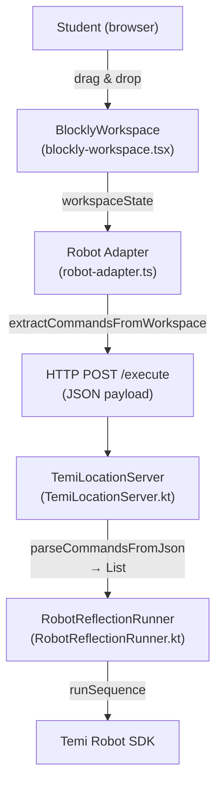
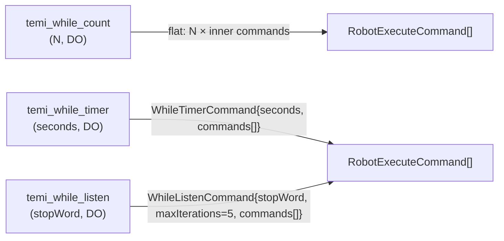

# Design Document — temi-while-block

## Overview

This feature adds three independent "while" loop blocks to the Blockly visual programming workspace used by students to program the Temi robot. Each block encodes its own looping condition — there are no separate condition blocks to connect.

| Block | Condition | Expansion strategy |
|---|---|---|
| `temi_while_count` | counter < N (N ∈ [1,50]) | **Flat expansion** — identical to `temi_repeat` |
| `temi_while_timer` | elapsed time < N seconds (N ∈ [1,300]) | **Structured command** — `WhileTimerCommand` sent to Android |
| `temi_while_listen` | lastAnswer ≠ stopWord (max 5 iterations, first always runs) | **Structured command** — `WhileListenCommand` sent to Android |

The change spans three layers:

1. **Blockly UI** (`src/components/blockly-workspace.tsx`) — three new block definitions under the existing "Control" category.
2. **Web adapter** (`src/lib/robot-adapter.ts`) — three new command types and extraction logic in `extractCommandsFromWorkspace`.
3. **Android app** (`RobotCommandRunner.kt` / `TemiLocationServer.kt` / `RobotReflectionRunner.kt`) — sealed subclasses and parser/execution support for `WhileCount`, `WhileTimer`, and `WhileListen`.

---

## Architecture



### Expansion strategy per block



`temi_while_count` uses the same flat-expansion strategy as `temi_repeat` — the Android side never sees a `WhileCount` command in the primary execution path. `temi_while_timer` and `temi_while_listen` emit structured commands because their loop termination depends on runtime state (wall-clock time, speech recognition) that only the Android runtime can evaluate.

---

## Components and Interfaces

### 1. Blockly Block Definitions (`blockly-workspace.tsx`)

All three blocks are added inside `defineTemiBlocks` and registered in the "Control" toolbox category alongside `temi_repeat`.

#### `temi_while_count`

```typescript
{
  type: "temi_while_count",
  message0: "repetir mientras contador < %1",
  args0: [{ type: "field_number", name: "LIMIT", value: 5, min: 1, max: 50, precision: 1 }],
  message1: "%1",
  args1: [{ type: "input_statement", name: "DO" }],
  previousStatement: null,
  nextStatement: null,
  colour: 120,
  tooltip: "Repite los bloques internos mientras el contador sea menor que N",
  helpUrl: ""
}
```

#### `temi_while_timer`

```typescript
{
  type: "temi_while_timer",
  message0: "repetir mientras tiempo < %1 segundos",
  args0: [{ type: "field_number", name: "SECONDS", value: 30, min: 1, max: 300, precision: 1 }],
  message1: "%1",
  args1: [{ type: "input_statement", name: "DO" }],
  previousStatement: null,
  nextStatement: null,
  colour: 120,
  tooltip: "Repite los bloques internos mientras el tiempo transcurrido sea menor que N segundos",
  helpUrl: ""
}
```

#### `temi_while_listen`

```typescript
{
  type: "temi_while_listen",
  message0: "repetir hasta escuchar %1",
  args0: [{ type: "field_input", name: "STOP_WORD", text: "listo" }],
  message1: "%1",
  args1: [{ type: "input_statement", name: "DO" }],
  previousStatement: null,
  nextStatement: null,
  colour: 120,
  tooltip: "Repite los bloques internos hasta que el robot escuche la palabra de parada (máx. 5 veces)",
  helpUrl: ""
}
```

The `maxIterations` limit of 5 is **not exposed** as a field; it is a fixed constant injected by the adapter.

#### Updated "Control" toolbox category

```typescript
{
  kind: "category",
  name: "Control",
  colour: "#4a7c59",
  contents: [
    { kind: "block", type: "temi_repeat" },
    { kind: "block", type: "temi_while_count" },
    { kind: "block", type: "temi_while_timer" },
    { kind: "block", type: "temi_while_listen" },
  ]
}
```

### 2. Command Types (`robot-adapter.ts`)

```typescript
export type WhileCountCommand = {
  type: "WhileCount";
  limit: number;                  // 1–50
  commands: RobotExecuteCommand[];
};

export type WhileTimerCommand = {
  type: "WhileTimer";
  seconds: number;                // 1–300
  commands: RobotExecuteCommand[];
};

export type WhileListenCommand = {
  type: "WhileListen";
  stopWord: string;               // trimmed; default "listo"
  maxIterations: number;          // always 5 (fixed by adapter)
  commands: RobotExecuteCommand[];
};

// Updated union
export type RobotExecuteCommand =
  | NavigateCommand
  | SayCommand
  | ShowImageCommand
  | ShowVideoCommand
  | AskConditionCommand
  | RepeatCommand
  | WhileCountCommand    // ← new (used internally; expanded before send)
  | WhileTimerCommand    // ← new
  | WhileListenCommand;  // ← new
```

> `WhileCountCommand` is included in the union for type completeness but `extractCommandsFromWorkspace` never emits it in the output — it expands inline just like `RepeatCommand`.

### 3. Command Extraction (`robot-adapter.ts`)

New branches added to the `walk` function inside `extractCommandsFromWorkspace`:

```typescript
} else if (b["type"] === "temi_while_count") {
  const limit = Math.max(1, Math.min(50, parseInt(fields?.["LIMIT"] ?? "5", 10)));
  const doInput = (b["inputs"] as Record<string, unknown>)?.["DO"];
  const innerBlock = (doInput as Record<string, unknown>)?.["block"];
  const innerCommands: RobotExecuteCommand[] = [];
  walk(innerBlock, innerCommands);
  for (let i = 0; i < limit; i++) acc.push(...innerCommands);

} else if (b["type"] === "temi_while_timer") {
  const seconds = Math.max(1, Math.min(300, parseInt(fields?.["SECONDS"] ?? "30", 10)));
  const doInput = (b["inputs"] as Record<string, unknown>)?.["DO"];
  const innerBlock = (doInput as Record<string, unknown>)?.["block"];
  const innerCommands: RobotExecuteCommand[] = [];
  walk(innerBlock, innerCommands);
  acc.push({ type: "WhileTimer", seconds, commands: innerCommands });

} else if (b["type"] === "temi_while_listen") {
  const rawWord = (fields?.["STOP_WORD"] ?? "").trim();
  const stopWord = rawWord.length > 0 ? rawWord : "listo";
  const doInput = (b["inputs"] as Record<string, unknown>)?.["DO"];
  const innerBlock = (doInput as Record<string, unknown>)?.["block"];
  const innerCommands: RobotExecuteCommand[] = [];
  walk(innerBlock, innerCommands);
  acc.push({ type: "WhileListen", stopWord, maxIterations: 5, commands: innerCommands });
}
```

### 4. Android — Sealed Subclasses (`RobotCommandRunner.kt`)

```kotlin
sealed class RobotCommand {
    // … existing subclasses …
    data class WhileCount(val limit: Int, val commands: List<RobotCommand>) : RobotCommand()
    data class WhileTimer(val seconds: Int, val commands: List<RobotCommand>) : RobotCommand()
    data class WhileListen(
        val stopWord: String,
        val maxIterations: Int,
        val commands: List<RobotCommand>
    ) : RobotCommand()
}
```

### 5. Android — Parser (`TemiLocationServer.kt`)

Three new cases added to `parseCommandsFromJson`:

```kotlin
"WhileCount" -> {
    val limitMatch = Regex(""""limit"\s*:\s*(\d+)""").find(context)
    val limit = limitMatch?.groupValues?.getOrNull(1)?.toIntOrNull() ?: 0
    val innerCommands = parseInnerCommandsFromContext(context)
    if (innerCommands != null) {
        commands.add(RobotCommand.WhileCount(limit, innerCommands))
        Log.d(TAG, "  ✓ WhileCount: limit=$limit innerCommands=${innerCommands.size}")
    }
}
"WhileTimer" -> {
    val secondsMatch = Regex(""""seconds"\s*:\s*(\d+)""").find(context)
    val seconds = secondsMatch?.groupValues?.getOrNull(1)?.toIntOrNull() ?: 0
    val innerCommands = parseInnerCommandsFromContext(context)
    if (innerCommands != null) {
        commands.add(RobotCommand.WhileTimer(seconds, innerCommands))
        Log.d(TAG, "  ✓ WhileTimer: seconds=$seconds innerCommands=${innerCommands.size}")
    }
}
"WhileListen" -> {
    val stopWordMatch = Regex(""""stopWord"\s*:\s*"([^"]+)"""").find(context)
    val stopWord = stopWordMatch?.groupValues?.getOrNull(1) ?: "listo"
    val maxIterMatch = Regex(""""maxIterations"\s*:\s*(\d+)""").find(context)
    val maxIterations = maxIterMatch?.groupValues?.getOrNull(1)?.toIntOrNull() ?: 5
    val innerCommands = parseInnerCommandsFromContext(context)
    if (innerCommands != null) {
        commands.add(RobotCommand.WhileListen(stopWord, maxIterations, innerCommands))
        Log.d(TAG, "  ✓ WhileListen: stopWord='$stopWord' maxIterations=$maxIterations innerCommands=${innerCommands.size}")
    }
}
```

`parseInnerCommandsFromContext` is already implemented for `Repeat` and is reused without modification.

### 6. Android — Execution (`RobotReflectionRunner.kt`)

Three new branches in the `run` `when` expression. The runner also needs a mutable `lastAnswer` field in its execution context (shared with `AskCondition`/`askConditionAndWait`):

```kotlin
// Shared execution context — updated by askConditionAndWait after each ASR result
@Volatile private var lastAnswer: String? = null
```

```kotlin
is RobotCommand.WhileCount -> {
    if (command.limit < 1) return Result.success(Unit)
    var counter = 0
    while (counter < command.limit) {
        val result = runSequence(command.commands)
        if (result.isFailure) return result
        counter++
    }
    Result.success(Unit)
}

is RobotCommand.WhileTimer -> {
    if (command.seconds < 1) return Result.success(Unit)
    val startMs = System.currentTimeMillis()
    val limitMs = command.seconds * 1000L
    while (System.currentTimeMillis() - startMs < limitMs) {
        val result = runSequence(command.commands)
        if (result.isFailure) return result
    }
    Result.success(Unit)
}

is RobotCommand.WhileListen -> {
    if (command.maxIterations < 1) return Result.success(Unit)
    var iterations = 0
    while (iterations < command.maxIterations) {
        // First iteration always runs (lastAnswer is null initially)
        val current = lastAnswer
        if (iterations > 0 && current != null &&
            current.trim().equals(command.stopWord.trim(), ignoreCase = true)) {
            break
        }
        val result = runSequence(command.commands)
        if (result.isFailure) return result
        iterations++
    }
    Result.success(Unit)
}
```

`lastAnswer` is a `@Volatile` field on `RobotReflectionRunner` (shared execution context). It is updated inside `askConditionAndWait` immediately after receiving any non-empty ASR result — before the latch countdown — so it is always current by the time `WhileListen` reads it between iterations:

```kotlin
// Shared execution context on RobotReflectionRunner
@Volatile private var lastAnswer: String? = null

// Inside askConditionAndWait, in the onAsrResult callback, after normalization:
lastAnswer = asrText   // store the raw trimmed lowercase ASR text
latch.countDown()
```

> **Important:** `WhileListen` depends on the student placing a `temi_ask_question` block inside the `DO` body. That block triggers `askConditionAndWait`, which updates `lastAnswer`. Without a question block in the body, `lastAnswer` never changes and the loop runs to `maxIterations`.

---

## Data Models

### TypeScript (`robot-adapter.ts`)

```typescript
export type WhileCountCommand = {
  type: "WhileCount";
  limit: number;           // 1–50, clamped by adapter
  commands: RobotExecuteCommand[];
};

export type WhileTimerCommand = {
  type: "WhileTimer";
  seconds: number;         // 1–300, clamped by adapter
  commands: RobotExecuteCommand[];
};

export type WhileListenCommand = {
  type: "WhileListen";
  stopWord: string;        // trimmed; "listo" if blank
  maxIterations: number;   // always 5
  commands: RobotExecuteCommand[];
};
```

### Blockly Workspace State (JSON examples)

**`temi_while_count`** (serialised by Blockly):
```json
{
  "type": "temi_while_count",
  "fields": { "LIMIT": 3 },
  "inputs": {
    "DO": { "block": { "type": "temi_move", "fields": { "LOCATION": "Sala" } } }
  }
}
```

**`temi_while_timer`**:
```json
{
  "type": "temi_while_timer",
  "fields": { "SECONDS": 60 },
  "inputs": {
    "DO": { "block": { "type": "temi_say", "fields": { "TEXT": "Hola" } } }
  }
}
```

**`temi_while_listen`**:
```json
{
  "type": "temi_while_listen",
  "fields": { "STOP_WORD": "listo" },
  "inputs": {
    "DO": { "block": { "type": "temi_say", "fields": { "TEXT": "¿Terminaste?" } } }
  }
}
```

### JSON payload sent to Android

`temi_while_count` is **never** sent as a structured command — it is pre-expanded to a flat sequence identical to `temi_repeat`.

`temi_while_timer` and `temi_while_listen` are sent as structured objects:

```json
{ "commands": [
    { "type": "WhileTimer", "seconds": 60,
      "commands": [{ "type": "Say", "text": "Hola" }] },
    { "type": "WhileListen", "stopWord": "listo", "maxIterations": 5,
      "commands": [{ "type": "Say", "text": "¿Terminaste?" }] }
]}
```

### Kotlin (`RobotCommandRunner.kt`)

```kotlin
sealed class RobotCommand {
    data class Navigate(val location: String) : RobotCommand()
    data class Say(val text: String) : RobotCommand()
    data class ShowImage(val imageUrl: String, val durationMs: Long = 7000L) : RobotCommand()
    data class ShowVideo(val videoUrl: String) : RobotCommand()
    data class AskCondition(val question: String, val options: List<ConditionOption>) : RobotCommand()
    data class Repeat(val times: Int, val commands: List<RobotCommand>) : RobotCommand()
    data class WhileCount(val limit: Int, val commands: List<RobotCommand>) : RobotCommand()
    data class WhileTimer(val seconds: Int, val commands: List<RobotCommand>) : RobotCommand()
    data class WhileListen(
        val stopWord: String,
        val maxIterations: Int,
        val commands: List<RobotCommand>
    ) : RobotCommand()
}
```


---

## Correctness Properties

*A property is a characteristic or behavior that should hold true across all valid executions of a system — essentially, a formal statement about what the system should do. Properties serve as the bridge between human-readable specifications and machine-verifiable correctness guarantees.*

### Property 1: LIMIT field clamping

*For any* integer input to the `LIMIT` field of `temi_while_count`, the resulting value SHALL always be in the range [1, 50]. Any value less than 1 SHALL be clamped to 1; any value greater than 50 SHALL be clamped to 50.

**Validates: Requirements 1.3, 1.4**

---

### Property 2: SECONDS field clamping

*For any* integer input to the `SECONDS` field of `temi_while_timer`, the resulting value SHALL always be in the range [1, 300]. Any value less than 1 SHALL be clamped to 1; any value greater than 300 SHALL be clamped to 300.

**Validates: Requirements 2.3, 2.4**

---

### Property 3: temi_while_count flat expansion correctness

*For any* Blockly workspace containing a `temi_while_count` block with limit N and an inner sequence of M commands, `extractCommandsFromWorkspace` SHALL produce a flat output where the inner M commands appear exactly N times in order, with any commands before or after the block also preserved in their correct positions.

**Validates: Requirements 4.1, 4.2, 4.3, 4.4, 4.6**

---

### Property 4: temi_while_count nested expansion

*For any* `temi_while_count` block nested inside another loop block (repeat or while_count) with outer count N_outer and inner count N_inner, and an innermost sequence of K commands, `extractCommandsFromWorkspace` SHALL produce exactly N_outer × N_inner × K commands in the correct order.

**Validates: Requirements 4.5**

---

### Property 5: WhileTimerCommand emission correctness

*For any* `temi_while_timer` block with seconds S and an inner sequence of M commands, `extractCommandsFromWorkspace` SHALL emit exactly one `WhileTimerCommand` with `seconds = S` and a `commands` array of length M containing the inner commands in order. Commands before and after the block SHALL be preserved in their correct positions.

**Validates: Requirements 5.1, 5.2, 5.3, 5.4, 5.5**

---

### Property 6: WhileListenCommand emission correctness

*For any* `temi_while_listen` block with stop word W and an inner sequence of M commands, `extractCommandsFromWorkspace` SHALL emit exactly one `WhileListenCommand` with `stopWord = W` (trimmed, defaulting to "listo" if blank), `maxIterations = 5`, and a `commands` array of length M containing the inner commands in order.

**Validates: Requirements 6.1, 6.2, 6.3, 6.4, 6.5**

---

### Property 7: Android parser round-trip for WhileCount

*For any* valid JSON payload containing a `WhileCount` command with limit L and inner commands C, `parseCommandsFromJson` SHALL produce a `RobotCommand.WhileCount` with `limit = L` and an inner `commands` list equivalent to C.

**Validates: Requirements 8.1, 8.2**

---

### Property 8: Android parser round-trip for WhileTimer

*For any* valid JSON payload containing a `WhileTimer` command with seconds S and inner commands C, `parseCommandsFromJson` SHALL produce a `RobotCommand.WhileTimer` with `seconds = S` and an inner `commands` list equivalent to C.

**Validates: Requirements 9.1, 9.2**

---

### Property 9: Android parser round-trip for WhileListen

*For any* valid JSON payload containing a `WhileListen` command with stopWord W, maxIterations I, and inner commands C, `parseCommandsFromJson` SHALL produce a `RobotCommand.WhileListen` with `stopWord = W`, `maxIterations = I`, and an inner `commands` list equivalent to C.

**Validates: Requirements 10.1, 10.2**

---

### Property 10: WhileCount execution count

*For any* `RobotCommand.WhileCount` with `limit = N` (N ≥ 1) and a non-empty inner command list, `RobotReflectionRunner` SHALL invoke `runSequence` on the inner commands exactly N times. When `limit < 1`, it SHALL invoke `runSequence` zero times and return `Result.success(Unit)`.

**Validates: Requirements 8.4, 8.5, 8.6**

---

### Property 11: WhileTimer elapsed-time loop

*For any* `RobotCommand.WhileTimer` with `seconds = S` (S ≥ 1), `RobotReflectionRunner` SHALL capture a single start timestamp before the first iteration and continue calling `runSequence` while `(currentTime - startTime) < S * 1000`. The start timestamp SHALL NOT be reset between iterations. When `seconds < 1`, it SHALL execute zero times.

**Validates: Requirements 9.4, 9.5, 9.6, 9.7**

---

### Property 12: WhileListen stop condition and iteration cap

*For any* `RobotCommand.WhileListen` with `stopWord = W` and `maxIterations = N`:
- The first iteration SHALL always execute regardless of `lastAnswer`.
- For each subsequent iteration, if `lastAnswer.trim()` equals `W.trim()` (case-insensitive), the loop SHALL stop before executing that iteration.
- The loop SHALL execute at most N iterations total regardless of `lastAnswer`.
- When `maxIterations < 1`, it SHALL execute zero times.

**Validates: Requirements 10.4, 10.5, 10.6, 10.7**

---

### Property 13: Failure propagation across all while variants

*For any* while command (`WhileCount`, `WhileTimer`, or `WhileListen`) where one of the inner commands returns a `Result.failure` during an iteration, `RobotReflectionRunner` SHALL stop execution immediately at that point and return the same failure, without executing any subsequent commands in that iteration or any further iterations.

**Validates: Requirements 8.7, 9.8, 10.8**

---

### Property 14: Toolbox category filter hides all while blocks

*For any* `allowedCategories` array that does not contain `"Control"`, the filtered toolbox produced by `BlocklyWorkspace` SHALL contain no entry with type `temi_while_count`, `temi_while_timer`, or `temi_while_listen`.

**Validates: Requirements 11.1, 11.2**

---

## Error Handling

| Scenario | Layer | Handling |
|---|---|---|
| `LIMIT` field is NaN or missing | TypeScript adapter | `parseInt` fallback to `"5"`, then clamped to [1,50] |
| `SECONDS` field is NaN or missing | TypeScript adapter | `parseInt` fallback to `"30"`, then clamped to [1,300] |
| `STOP_WORD` field is blank or whitespace-only | TypeScript adapter | Defaults to `"listo"` after trim |
| `DO` input is empty for any while block | TypeScript adapter | `innerCommands` is empty; zero commands appended / empty `commands` array emitted |
| `temi_while_count` nested arbitrarily deep | TypeScript adapter | Recursive `walk` handles any depth; bounded by Blockly's own nesting limit |
| `WhileCount` JSON missing `limit` field | Android parser | Defaults to 0; runner executes zero times (safe no-op) |
| `WhileTimer` JSON missing `seconds` field | Android parser | Defaults to 0; runner executes zero times (safe no-op) |
| `WhileListen` JSON missing `stopWord` field | Android parser | Defaults to `"listo"` |
| `WhileListen` JSON missing `maxIterations` field | Android parser | Defaults to 5 |
| Any while command JSON missing `commands` array | Android parser | Returns `null` inner list; command is skipped |
| Inner command fails during any while loop | Android runner | `runSequence` returns failure immediately; while loop propagates it |
| `limit < 1` / `seconds < 1` / `maxIterations < 1` at runtime | Android runner | Returns `Result.success(Unit)` immediately without executing inner commands |
| `lastAnswer` is null on first WhileListen iteration | Android runner | First iteration always runs unconditionally (null is not equal to any stopWord) |
| WhileTimer loop body takes longer than `seconds` | Android runner | Loop exits after the current iteration completes; no mid-iteration interruption |

---

## Testing Strategy

### Unit Tests (TypeScript)

- **`extractCommandsFromWorkspace` with `temi_while_count`**: verify flat expansion for N=1, N=5, N=50, empty body, and commands before/after the block.
- **`extractCommandsFromWorkspace` with `temi_while_timer`**: verify a single `WhileTimerCommand` is emitted with correct `seconds` and `commands`; verify empty body produces empty `commands` array.
- **`extractCommandsFromWorkspace` with `temi_while_listen`**: verify a single `WhileListenCommand` is emitted with correct `stopWord`, `maxIterations=5`, and `commands`; verify blank `STOP_WORD` defaults to `"listo"`.
- **Nested while_count**: verify N_outer × N_inner expansion.
- **`LIMIT` clamping**: boundary values (0→1, 1→1, 50→50, 51→50, -3→1).
- **`SECONDS` clamping**: boundary values (0→1, 1→1, 300→300, 301→300, -1→1).
- **Toolbox filter**: verify "Control" category is excluded when not in `allowedCategories`.

### Property-Based Tests (TypeScript — fast-check)

Using [fast-check](https://github.com/dubzzz/fast-check):

- **Property 1** — Generate arbitrary integers (including negatives and values > 50), apply the LIMIT clamp, assert result ∈ [1,50].
- **Property 2** — Generate arbitrary integers, apply the SECONDS clamp, assert result ∈ [1,300].
- **Property 3** — Generate arbitrary (N ∈ [1,50], inner command list of length M ∈ [0,5]) pairs, build a synthetic workspace JSON with `temi_while_count`, call `extractCommandsFromWorkspace`, assert output length = N × M and order is preserved.
- **Property 4** — Generate arbitrary (N_outer, N_inner, K) triples, build nested workspace JSON, assert output length = N_outer × N_inner × K.
- **Property 5** — Generate arbitrary (S ∈ [1,300], inner command list of length M ∈ [0,5]) pairs, build workspace JSON with `temi_while_timer`, assert output is a single `WhileTimerCommand` with `seconds = S` and `commands.length = M`.
- **Property 6** — Generate arbitrary (stopWord string, inner command list of length M ∈ [0,5]) pairs, build workspace JSON with `temi_while_listen`, assert output is a single `WhileListenCommand` with correct `stopWord`, `maxIterations = 5`, and `commands.length = M`.
- **Property 14** — Generate arbitrary subsets of `["Movimiento", "Hablar", "Mostrar", "Audio", "Condición"]` (never including "Control"), apply the toolbox filter, assert no `temi_while_*` block appears.

Each property test runs a minimum of **100 iterations**.

Tag format: `// Feature: temi-while-block, Property N: <property_text>`

### Property-Based Tests (Kotlin — Kotest PropTest)

Using [Kotest PropTest](https://kotest.io/docs/proptest/property-based-testing.html):

- **Property 7** — Generate arbitrary `(limit: Int, innerCommands: List<RobotCommand>)` pairs, serialise to JSON, parse with `parseCommandsFromJson`, assert the result is a `RobotCommand.WhileCount` with matching fields.
- **Property 8** — Generate arbitrary `(seconds: Int, innerCommands: List<RobotCommand>)` pairs, serialise to JSON, parse, assert `RobotCommand.WhileTimer` with matching fields.
- **Property 9** — Generate arbitrary `(stopWord: String, maxIterations: Int, innerCommands: List<RobotCommand>)` triples, serialise to JSON, parse, assert `RobotCommand.WhileListen` with matching fields.
- **Property 10** — Generate arbitrary `(limit: Int, innerCommands: List<RobotCommand>)` pairs using a mock `RobotCommandRunner`. Assert mock's `runSequence` call count equals `max(0, limit)`.
- **Property 11** — Use a mock clock injected into `RobotReflectionRunner`. Generate arbitrary `(seconds: Int, iterationDurationMs: Long)` pairs. Assert the number of `runSequence` calls matches the expected count given the simulated elapsed time, and that the start timestamp is captured exactly once.
- **Property 12** — Generate arbitrary `(stopWord: String, maxIterations: Int, lastAnswerSequence: List<String?>)` triples. Simulate `lastAnswer` updates after each iteration. Assert the loop stops at the first case-insensitive match or after `maxIterations`, whichever comes first, and that the first iteration always runs.
- **Property 13** — Generate arbitrary while commands where one inner command is a failing mock. Assert execution stops and the failure is propagated for all three while variants.

Each property test runs a minimum of **100 iterations**.

### Integration Tests

- End-to-end: build a workspace with each while block, call `executeRobotCommands` against a mock HTTP server, verify the correct payload arrives (`WhileTimerCommand` and `WhileListenCommand` as structured objects; `temi_while_count` as a flat sequence).
- Android: send JSON payloads for `WhileTimer` and `WhileListen` to `TemiLocationServer` on a test port, verify `parseCommandsFromJson` returns the correct `RobotCommand` instances with all fields populated.
