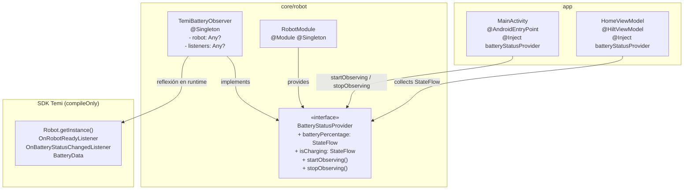
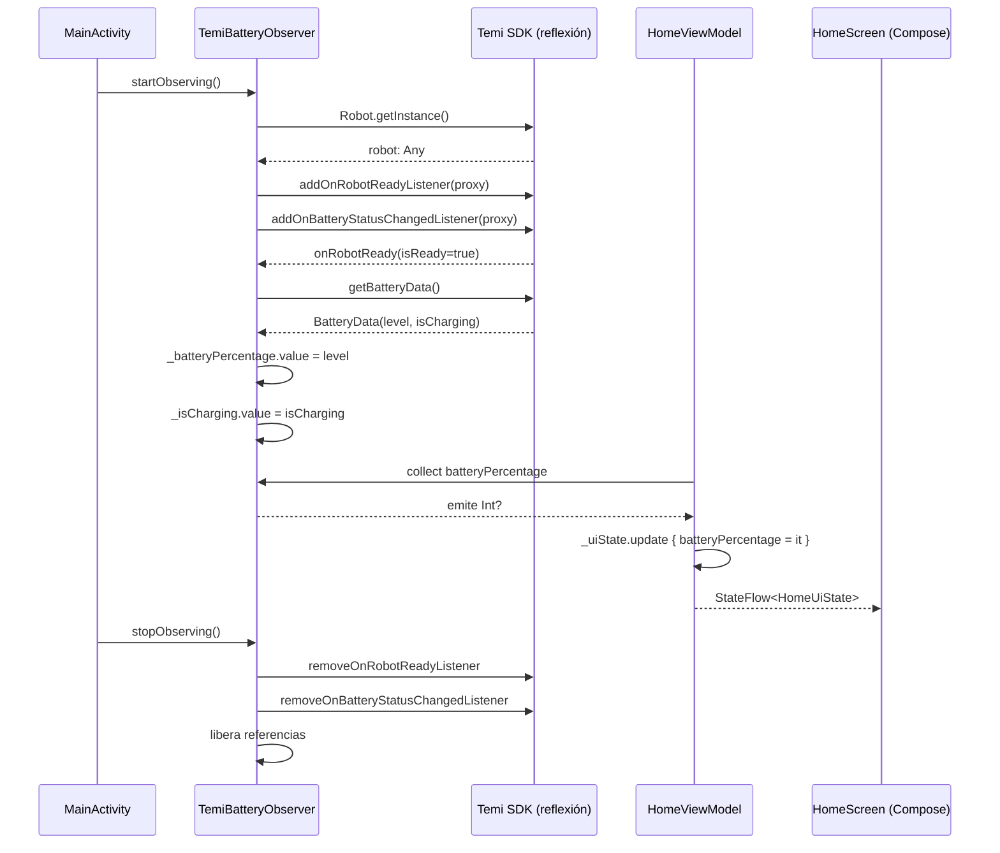

# Diseño Técnico: temi-battery-solid-refactor

## Visión General

Este documento describe el diseño técnico para refactorizar la integración del SDK de Temi en la aplicación Android EduLab, aplicando los principios SOLID (Single Responsibility y Dependency Inversion) siguiendo el patrón ya establecido en el proyecto con `NetworkStatusProvider` / `ConnectivityObserver` / `NetworkModule`.

### Objetivo

Extraer toda la lógica de reflexión del SDK de Temi de `MainActivity` hacia una capa de abstracción dedicada (`BatteryStatusProvider` / `TemiBatteryObserver`), provista mediante Hilt, de modo que:

- `MainActivity` quede reducida a montar la UI y gestionar el idioma.
- `HomeViewModel` reciba el estado de batería de forma reactiva sin acoplarse al SDK.
- La lógica de reflexión esté aislada y sea testeable de forma independiente.

### Patrón de referencia

El diseño replica exactamente la estructura de `core/network/`:

| Red (existente)         | Robot (nuevo)              |
|-------------------------|----------------------------|
| `NetworkStatusProvider` | `BatteryStatusProvider`    |
| `ConnectivityObserver`  | `TemiBatteryObserver`      |
| `NetworkModule`         | `RobotModule`              |
| `FakeNetworkStatusProvider` | `FakeBatteryStatusProvider` |

---

## Arquitectura



### Flujo de datos



---

## Componentes e Interfaces

### BatteryStatusProvider (interfaz)

Reside en `core/robot/BatteryStatusProvider.kt`. Define el contrato de acceso al estado de batería del robot.

```kotlin
interface BatteryStatusProvider {
    val batteryPercentage: StateFlow<Int?>
    val isCharging: StateFlow<Boolean>
    fun startObserving()
    fun stopObserving()
}
```

### TemiBatteryObserver (implementación)

Reside en `core/robot/TemiBatteryObserver.kt`. Encapsula toda la lógica de reflexión actualmente dispersa en `MainActivity`.

Responsabilidades:
- Obtener `Robot.getInstance()` mediante reflexión.
- Registrar/desregistrar `OnRobotReadyListener` y `OnBatteryStatusChangedListener` mediante `Proxy.newProxyInstance`.
- Leer el valor inicial de batería en `onRobotReady`.
- Actualizar los `MutableStateFlow` internos con cada cambio de batería.
- Capturar y loguear cualquier excepción de reflexión sin propagar el error.
- Liberar todas las referencias en `stopObserving()`.

### RobotModule (módulo Hilt)

Reside en `core/robot/RobotModule.kt`. Provee `BatteryStatusProvider` como singleton al grafo de dependencias.

```kotlin
@Module
@InstallIn(SingletonComponent::class)
object RobotModule {
    @Provides
    @Singleton
    fun provideBatteryStatusProvider(
        @ApplicationContext context: Context
    ): BatteryStatusProvider = TemiBatteryObserver(context)
}
```

### HomeViewModel (modificado)

Recibe `BatteryStatusProvider` por inyección de constructor. Se suscribe reactivamente a los dos `StateFlow` en el bloque `init`. Se elimina `updateBattery()`.

### MainActivity (modificada)

Inyecta `BatteryStatusProvider` con `@Inject`. Llama `startObserving()` en `onStart()` y `stopObserving()` en `onStop()`. Se eliminan todas las variables de estado del robot y los métodos `setupTemi`, `teardownTemi`, `readInitialBattery`, `parseBatteryData`.

---

## Modelos de Datos

### HomeUiState (sin cambios estructurales)

```kotlin
data class HomeUiState(
    val isConnected: Boolean = false,
    val currentTime: String = "",
    val batteryPercentage: Int? = null,   // null = sin dato aún
    val isCharging: Boolean = false
)
```

El campo `batteryPercentage` ya es `Int?`, por lo que no requiere cambios en el modelo. El valor `null` representa el estado inicial antes de recibir datos del robot.

### Estado interno de TemiBatteryObserver

```kotlin
// Flujos públicos (expuestos como StateFlow de solo lectura)
private val _batteryPercentage = MutableStateFlow<Int?>(null)
private val _isCharging = MutableStateFlow(false)

// Referencias internas (liberadas en stopObserving)
private var robot: Any? = null
private var robotClass: Class<*>? = null
private var robotReadyListener: Any? = null
private var robotReadyListenerClass: Class<*>? = null
private var batteryListener: Any? = null
private var batteryListenerClass: Class<*>? = null
```

---

## Propiedades de Corrección

*Una propiedad es una característica o comportamiento que debe mantenerse verdadero en todas las ejecuciones válidas del sistema — esencialmente, una declaración formal sobre lo que el sistema debe hacer. Las propiedades sirven como puente entre las especificaciones legibles por humanos y las garantías de corrección verificables por máquina.*

### Propiedad 1: Valores válidos de batería se reflejan en el estado

*Para cualquier* porcentaje de batería en el rango [0, 100] y cualquier valor booleano de `isCharging`, cuando `FakeBatteryStatusProvider` emite esos valores, `HomeViewModel` debe actualizar `HomeUiState.batteryPercentage` e `HomeUiState.isCharging` con exactamente esos valores.

**Valida: Requisitos 4.2, 4.3, 6.2, 6.3**

### Propiedad 2: Valores de batería fuera de rango son ignorados

*Para cualquier* entero fuera del rango [0, 100], cuando `TemiBatteryObserver` recibe ese valor en el callback `onBatteryStatusChanged`, el `StateFlow` de `batteryPercentage` no debe actualizarse.

**Valida: Requisito 2.11**

### Propiedad 3: batteryPercentage null se propaga sin excepción

*Para cualquier* `HomeViewModel` inicializado con una `FakeBatteryStatusProvider` que emite `null` en `batteryPercentage`, el estado `HomeUiState.batteryPercentage` debe ser `null` y no debe lanzarse ninguna excepción.

**Valida: Requisitos 4.5, 6.5**

### Propiedad 4: startObserving / stopObserving es idempotente en cuanto a estado

*Para cualquier* instancia de `TemiBatteryObserver` sin SDK disponible, llamar a `startObserving()` seguido de `stopObserving()` debe dejar `batteryPercentage` como `null` e `isCharging` como `false`, sin lanzar excepciones.

**Valida: Requisitos 2.9, 2.10**

### Propiedad 5: Secuencia de emisiones refleja el último valor

*Para cualquier* secuencia no vacía de porcentajes válidos emitidos por `FakeBatteryStatusProvider`, `HomeUiState.batteryPercentage` debe reflejar el último valor emitido.

**Valida: Requisitos 4.2, 6.2**

---

## Manejo de Errores

### Estrategia de reflexión defensiva

Toda operación de reflexión en `TemiBatteryObserver` está envuelta en `try/catch(Exception)`. Ante cualquier fallo:

1. Se registra el error con `Log.e(TAG, ...)`.
2. La ejecución continúa sin propagar la excepción.
3. Los `StateFlow` mantienen sus valores anteriores (`null` / `false` si es el estado inicial).

### SDK no disponible

Cuando el SDK de Temi no está instalado en el dispositivo (emulador, dispositivo de desarrollo), `Class.forName("com.robotemi.sdk.Robot")` lanza `ClassNotFoundException`. El bloque `try/catch` lo captura y `TemiBatteryObserver` permanece en estado inicial (`batteryPercentage = null`, `isCharging = false`).

### Valor de batería inválido

Si `level < 0 || level > 100`, el valor se descarta silenciosamente y los `StateFlow` no se actualizan. Esto protege la UI de mostrar porcentajes imposibles.

### Fugas de memoria

`stopObserving()` siempre ejecuta la limpieza de referencias en un bloque `finally`, garantizando que `robot`, `robotClass`, y los listeners se pongan a `null` incluso si la desregistración mediante reflexión falla.

---

## Estrategia de Testing

### Enfoque dual

Se combinan tests unitarios (ejemplos concretos y casos borde) con tests de propiedades (cobertura amplia mediante generación aleatoria de entradas).

**Librería de property-based testing**: `io.kotest:kotest-property:5.9.1` (ya incluida en el proyecto).

### Tests unitarios — `HomeViewModelTest`

Cubren:
- Estado inicial: `batteryPercentage = null`, `isCharging = false`.
- Emisión de valor válido actualiza ambos campos.
- Emisión de `null` mantiene `batteryPercentage` como `null`.
- Emisión de `isCharging = true` actualiza el campo.
- Las actualizaciones de batería no afectan `isConnected` ni `currentTime`.
- Casos borde: porcentaje 0 y 100.

### Tests de propiedades — `HomeViewModelTest`

Cada test de propiedad ejecuta mínimo 100 iteraciones con entradas generadas aleatoriamente.

| Test | Propiedad | Tag |
|------|-----------|-----|
| `Property 1: valores válidos se reflejan` | Propiedad 1 | `Feature: temi-battery-solid-refactor, Property 1` |
| `Property 2: valores fuera de rango ignorados` | Propiedad 2 | `Feature: temi-battery-solid-refactor, Property 2` |
| `Property 3: null se propaga sin excepción` | Propiedad 3 | `Feature: temi-battery-solid-refactor, Property 3` |
| `Property 5: secuencia refleja último valor` | Propiedad 5 | `Feature: temi-battery-solid-refactor, Property 5` |

La Propiedad 4 (comportamiento de `TemiBatteryObserver` sin SDK) se valida con un test unitario de ejemplo, ya que no hay entradas generables para el SDK ausente.

### FakeBatteryStatusProvider

Implementación de prueba que expone `MutableStateFlow` controlables desde los tests:

```kotlin
class FakeBatteryStatusProvider(
    initialPercentage: Int? = null,
    initialCharging: Boolean = false
) : BatteryStatusProvider {
    private val _batteryPercentage = MutableStateFlow(initialPercentage)
    private val _isCharging = MutableStateFlow(initialCharging)
    override val batteryPercentage: StateFlow<Int?> = _batteryPercentage
    override val isCharging: StateFlow<Boolean> = _isCharging
    override fun startObserving() = Unit
    override fun stopObserving() = Unit
    fun emitPercentage(value: Int?) { _batteryPercentage.value = value }
    fun emitCharging(value: Boolean) { _isCharging.value = value }
}
```

### Cobertura de tests existentes

Los tests existentes en `HomeViewModelTest` que usan `updateBattery()` serán migrados para usar `FakeBatteryStatusProvider`, manteniendo la misma cobertura semántica.
